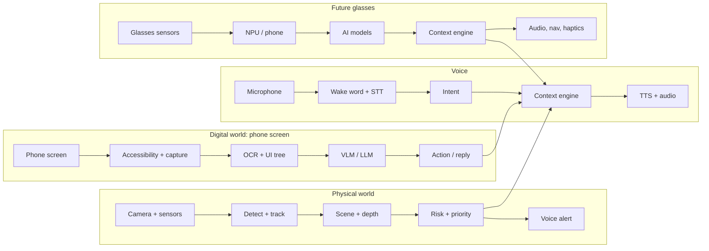

# 🕶️ AI Assistive Vision & Navigation System — Full Project Roadmap
### Team of 6 · 6-Month Build · Android-First, Then 3D-Printed Glasses

---

## 1. Project Overview

**What it is:** A voice-controlled assistant for blind and low-vision users. It sees the world through a camera (phone first, then 3D-printed glasses), reads the phone screen, navigates by voice, and speaks back through open-ear audio. No screen interaction is needed.

**What makes it more than "a camera with TTS":**
- It **understands** the scene: obstacles, vehicles, people, text, banknotes.
- A **context and priority engine** decides what is worth saying, so the user hears one calm voice instead of a stream of labels.
- It reads and navigates **other apps** (WhatsApp, Facebook) through the Android Accessibility API.
- Safety-critical alerts run **on the device** and keep working with no internet.

**Core rule:** the priority engine is the product. Every detection becomes an event with a risk score. Only events above the current threshold are spoken, and anything the user is already hearing is not repeated.

**Target users:**
- Primary: **blind and low-vision users** who want hands-free awareness of surroundings and phone content.
- Presented honestly as a **research prototype and assistive aid**, not a certified medical device and not a replacement for a white cane or guide.

**The iPhone problem:** the whole team uses iPhones, but screen understanding is only realistic on Android (iOS blocks other apps from reading or controlling third-party screens). Decision: buy one dedicated Android test phone in week 1. Everyone else can develop the backend, CV models and glasses firmware on laptops.

**Main use cases:**

| Use case | Description | Priority |
|---|---|---|
| Obstacle and vehicle warning | Detect, track, warn left/right, approaching-vehicle alert | 🟢 |
| Scene description / look-and-ask | "What's around me?", free-form questions via cloud VLM | 🟢 |
| OCR | Signs, menus, documents, medicine labels | 🟢 |
| Voice assistant | Wake word, commands, rule-based fast path | 🟢 |
| Navigation and SOS | Walking turn-by-turn, SMS with location | 🟢 |
| Screen understanding | Open app, read screen, scroll, summarize a post | 🟢 |
| WhatsApp / notification reading | Notification listener, read-only | 🟢 |
| Known-person recognition | Opt-in enrollment, unknown person announced generically | 🟡 |
| Currency recognition (EGP) | Needs own dataset | 🟡 |
| Reels / video content | VLM on screenshot, no audio | 🟡 |
| Send or reply to messages | Risky, needs confirmations | 🔴 Future |
| Stair detection | Needs reliable depth sensing | 🔴 Future |
| GVS direction cues | Research only, no human testing | 🔴 Research only |

---

## 2. MVP Definition

**Staged delivery. Each stage is a working demo:**

| Stage | What it is | Role |
|---|---|---|
| **Plan A** | Android app, phone camera and mic, cloud VLM | Guaranteed graduation demo |
| **Plan B1** | 3D-printed glasses (ESP32-S3: camera, distance sensor, IMU, mic, speaker) streaming to the phone | Hardware proof, phone does the AI |
| **Plan B2** | Same frame plus a small NPU module running detection, OCR and wake word on the glasses | Standalone-style goal within 30k EGP |
| **GVS** | Separate research track: simulation and literature only | Not in the demo path |

**MVP in one sentence:** an Android app plus a small FastAPI backend that detects hazards, reads text, answers questions about what the camera sees, reads the phone screen, navigates by voice, and sends an SOS, controlled entirely by voice.

**Explicitly NOT promised:**
- Free control of every app, or any control of banking and secure screens.
- Indoor depth maps from a phone camera.
- GVS on humans.
- Cloud-grade AI running offline on glasses.
- Vehicle speed or time-to-collision from one camera.
- Any safety guarantee in traffic.

**Post-MVP roadmap:**
- Send/reply to messages by voice (with spoken confirmation).
- Depth camera for stairs and drops.
- Indoor navigation with beacons.
- Arabic and Egyptian-dialect speech as a first-class language.
- Fully standalone glasses.

---

## 3. System Architecture



**Four pipelines, one shared context engine** that decides what the user hears.

**Local vs cloud rule:** anything safety-critical or high-frequency (obstacles, vehicles, wake word, SOS) runs on the device. Anything needing deep reasoning (scene description, screen summaries, translation) goes to the cloud.

| Component | On phone | Backend (FastAPI) | Cloud AI |
|---|---|---|---|
| Camera capture, frame sampling | ✅ | | |
| Object, person, vehicle detection + tracking (15-25 FPS) | ✅ | | |
| Risk and priority engine, alert queue | ✅ | | |
| Wake word, emergency keywords | ✅ | | |
| OCR (ML Kit) and QR | ✅ | | Fallback for hard or Arabic text |
| Face detection and embedding | ✅ | Known-people DB sync | |
| Scene description, look-and-ask | | Orchestrates, stores history | VLM API |
| Voice intent and LLM reasoning | Simple rules | Intent routing | LLM API |
| Screen understanding | Accessibility tree + screenshot | Prompt assembly | VLM/LLM summary |
| GPS, maps, turn-by-turn | Location, TTS | Directions proxy and cache | Maps API |
| SOS | SMS, call, location | Optional contact push | |
| Users, faces, settings, logs | SQLite cache | PostgreSQL + pgvector | |

**Risk levels:**
- **Critical** (vehicle approaching, stairs or drop, SOS): interrupts anything.
- **Warning** (obstacle ahead, person close): spoken at the next gap.
- **Info** (scene description, text, notifications): spoken only when asked, or when the user is idle and stationary.

**Fallback with no internet:** safety alerts, OCR, already-loaded navigation and SOS keep working. Only VLM answers and screen summaries are disabled, and the assistant says so.

---

## 4. AI Components

### Computer Vision and On-Device ML

| Component | Why needed | Recommended model | Where | Latency |
|---|---|---|---|---|
| Object / person / vehicle detection | Core hazard awareness | **YOLO nano-class** (YOLO11n/26n), fine-tuned, exported to LiteRT/ONNX | Phone GPU/NPU; B2 NPU board | 30-70 ms/frame, 15-25 FPS |
| Tracking + approaching vehicle | "Car from the right" | ByteTrack-style tracker + bounding-box growth rate | Phone CPU | < 5 ms |
| Obstacle distance | Real range, not guesses | TF-Luna LiDAR + VL53L5CX ToF array | Glasses MCU | 10-50 ms |
| Phone-only distance | Coarse near/far | Box-size heuristic, optional Depth Anything V2-small | Phone GPU | 100-300 ms |
| Face detection + recognition | Known-person names | ML Kit face detection + MobileFaceNet/ArcFace-style embedding, cosine match | Phone; embeddings in pgvector | 50-150 ms |
| OCR | Signs, menus, medicine labels | **ML Kit Text Recognition**; cloud VLM for hard text | Phone | 100-400 ms |
| Currency | EGP notes | Fine-tuned MobileNetV3-class classifier | Phone | < 50 ms |
| Color | "What color is this" | HSV analysis, VLM when asked | Phone / cloud | < 20 ms / 1-3 s |

**License note:** YOLO nano models are AGPL. Check the license, or use an Apache-licensed detector.

### Speech, NLP and LLM

| Component | Choice | Notes |
|---|---|---|
| Wake word | openWakeWord or Porcupine custom keyword | < 200 ms, false triggers in noise |
| Speech-to-text | Android on-device recognizer first; Whisper-class via backend as upgrade | Better for Egyptian Arabic and English mixing |
| Intent | Rules + small LLM call for free-form commands | Keep a rule-based fast path for emergencies |
| Scene / screen reasoning | Hosted multimodal API (Claude, Gemini or similar) via backend | 1.5-4 s, can hallucinate: informational use only, never safety-critical |
| Text-to-speech | Android offline TTS for alerts; neural cloud TTS for long reading | Offline Arabic voices vary by phone |
| Embeddings + vector search | pgvector in PostgreSQL | Only for known faces and saved places |

**Do not build:** recognition of arbitrary strangers by name, metric depth from a single RGB camera, accurate vehicle speed from one camera, or a large VLM running offline on glasses hardware.

---

## 5. Screen and App Interaction Architecture

Android makes this realistic through an **AccessibilityService**; iOS does not. It works app by app, not universally.

**Perception ladder (cheapest and most reliable first):**
1. **Accessibility node tree:** exact text, buttons, scroll containers. Free, offline.
2. **Screenshot + on-device OCR (ML Kit):** when nodes are empty or unlabeled.
3. **Screenshot + cloud VLM:** when layout, images or video frames matter.

**Voice command flow:**
1. Wake word + STT produce the command ("open Facebook and tell me about this post").
2. Intent parser maps it to an action list: launch app, wait for screen, read screen, summarize.
3. Launch intent opens the app; the service waits for the window to settle.
4. The service captures the node tree and, if needed, a screenshot.
5. Backend builds the prompt and calls the LLM/VLM.
6. TTS speaks the answer. Follow-ups ("scroll down") repeat from step 4.

**Capability classes:** 1 Fully possible · 2 Possible with user permission · 3 Possible through Accessibility APIs · 4 Only in our own controlled prototype · 5 Not realistically possible.

| Capability | Android | iPhone |
|---|---|---|
| Open an app by voice | 1 | 2 |
| Read notifications and new WhatsApp messages | 2 | 5 |
| Read visible screen text | 3 | 5 |
| Describe or summarize a screen | 2-3 | 4 |
| Scroll, back, tap a labeled button | 3 | 5 |
| Reel / video content (visible frame + caption) | 2-3 | 5 |
| Book reading inside our own reader | 4 | 4 |
| Send messages on the user's behalf | 3 (keep read-only in MVP) | 5 |
| Banking and password screens (`FLAG_SECURE`) | 5 | 5 |
| Games and unlabeled custom UIs | 5 | 5 |
| Controlling any app freely and silently | 5 | 5 |

**Safety rules for the demo:**
- Announce every action before performing it.
- Never tap send, delete, buy or pay without explicit spoken confirmation.
- Never read password or banking screens.
- Warn the user that screen content is sent to a cloud model.

**Policy reality:** Google Play only accepts Accessibility use mainly for people with disabilities. For the graduation project, **distribute a sideloaded APK** (enable "restricted settings" manually). Meta apps forbid automated scraping and change UIs freely, so build the demo on a personal account, one user, assistive use only.

---

## 6. Hardware Architecture

**Essential flow (B1):** Glasses sensors → BLE/Wi-Fi → Phone (all AI) → Audio back to glasses or headset.
**B2:** Glasses frame + thin cable → neck/belt pod with NPU board and battery → local detection, OCR, wake word.

| | Glasses + phone (B1) | Standalone (B2 goal) |
|---|---|---|
| Glasses do | Camera, distance, IMU, mic, speaker, buttons | All of B1 + local detection, OCR, wake word |
| Phone does | All AI, maps, SOS, screen reading | Cloud VLM, screen reading, maps, SOS |
| Weight and heat | Low | Higher, needs a pod |
| Risk | Low | Medium-high |
| Build first? | Yes | Second, on the same frame |

### Compute Platform Comparison

| Platform | AI capability | Fit |
|---|---|---|
| ESP32-S3 (with camera) | Tiny models, 1-5 FPS | Sensor hub, audio, BLE. Not the AI brain |
| Raspberry Pi Zero 2 W | CPU only | Too slow for real-time detection |
| Raspberry Pi 5 | 5-10 FPS nano YOLO, no NPU | Good for bench testing, poor to wear |
| Pi 5 + Hailo-8L | Strong (13 TOPS) | Great performance, ~12-20k EGP, runs hot |
| **RK3566 board (Radxa Zero 3W class)** | ~1 TOPS NPU | **Recommended B2 brain, 2-5k EGP** |
| Luckfox Pico-class (RV1106) | ~0.5 TOPS | Cheapest, very small models |
| Jetson Orin Nano | Very strong | Over budget, too hot and heavy |

### Glasses Sensors and Parts
- **Camera:** 5-8 MP wide-angle module at the bridge.
- **Distance:** TF-Luna single-point LiDAR + VL53L5CX-class ToF array (coarse 8x8 grid). Single-point is not depth mapping.
- **IMU:** MPU6050 or ICM-20948 for head pose and fall detection.
- **Audio:** I2S MEMS mics + small speaker or bone-conduction transducer (open-ear is safer for blind users).
- **Power:** 1S Li-ion/LiPo with protection BMS, USB-C charging, buck converters, fuel gauge.
- **Controls:** tactile buttons (capture, wake/mute, SOS) + vibration motors for left/right cues.
- **Link:** BLE for control and sensor data, Wi-Fi for camera frames.
- **Build approach:** perfboard first, custom PCB only after the layout is proven. Print in PETG or nylon with a vented pod.

**Thermal and weight targets:** frame under ~60 g on the face (verify by weighing), NPU board and battery in the pod, log board temperature over a 30-minute run before deciding what is safe to wear.

### Budgets
- **Mobile MVP:** ~10,000-25,000 EGP one-time (mostly one mid-range Android phone, 8-18k EGP).
- **Glasses B2:** ~10-21k EGP in parts, leaving 9-20k of the 30k for failed parts and reprints. **B1-only subset:** ~5-12k EGP.
- **Cloud/API:** ~30-120 USD per month during development (mostly VLM calls and a small VPS).

See `docs/hardware-bom.md` for the full parts list with quantities and EGP ranges.

---

## 7. GVS Feasibility (Research Track Only)

GVS stays **out of the MVP and out of the demo path.** This project gives no stimulation parameters and no instructions for applying electrical stimulation to people.

- Published research shows GVS can bias balance in a left/right direction. It is a research tool, not a proven navigation interface.
- Responses vary strongly between people and can cause dizziness, nausea, skin irritation and balance disturbance, which is a real hazard near traffic or stairs.

**Allowed deliverables (no human stimulation):**
1. Literature review and feasibility/risk report.
2. Block-level design and safety-case document.
3. Simulation that maps navigation commands to abstract cue requests.
4. Bench circuit on resistive dummy loads only, if the supervisor approves.

**Required before any human use:** faculty supervisor with biomedical expertise, university ethics approval, written informed consent, parameters set by qualified reviewers (not by students), no self-testing, no blind users as first subjects.

**MVP alternative:** spatial audio panning and left/right vibration motors deliver the same "turn this way" information with no medical risk.

---

## 8. Team of 6 — Responsibilities

### Team Assignment

| Member | Strengths | Role in the project | Maps to |
|---|---|---|---|
| **Mostafa Moko** | OCR, YOLO | Detection, tracking, approaching-vehicle logic, OCR, model export to phone and NPU board | Person 1 |
| **Boda** | LLM, TTS, STT | Voice stack (wake word, STT, TTS), intent parsing, VLM/LLM prompts for scene and screen summaries | Person 2 (AI side) |
| **Mostafa Sayed** | Backend | FastAPI backend, Docker, deployment, API contract; also the Android ↔ backend client | Person 2 (backend side) + Person 3 (with Boda) |
| **Mahmoud** | Databases, analysis, ML, DL | PostgreSQL + pgvector, dataset collection and labeling, training and evaluation of currency and face models, accuracy reports | Person 1 (data and training) |
| **Marwan** | AI diploma | Currency, face and color models, evaluation set, priority engine logic and navigation module (with Boda's voice output) | Person 1 (models) + Person 5 |
| **Loay** | Adaptable | Integration, testing, hardware assembly, CAD and 3D printing, field tests, demo script, documentation | Person 6 (+ Person 4 support) |

**Open gaps to close in month 1:** nobody has declared Android/Kotlin experience (Person 3) or ESP32 firmware experience (Person 4). Decide who learns each, or drop B2 to a stretch goal and use ready-made sensor modules for B1. Person 3 is the only real bottleneck, so two people should write Kotlin.

### Person 1 — Computer Vision
- **Responsibilities:** data collection and labeling (obstacles, vehicles, stairs, EGP currency, faces), fine-tune and quantize models, tracking, approach logic, benchmarks on phone and NPU board.
- **Technologies:** Python, PyTorch, YOLO, LiteRT/ONNX, OpenCV, ML Kit.
- **Folders owned:** `computer_vision/`
- **Output:** exported models, accuracy and latency report, tracking module.
- **Depends on:** Person 6 for field videos, Person 3 to integrate, Person 4 for the NPU board.

### Person 2 — AI, VLM/LLM and Backend
- **Responsibilities:** backend API, prompts for scene and screen summaries, intent parsing, known-people database, caching, cost limits.
- **Technologies:** FastAPI, PostgreSQL + pgvector, Docker, hosted VLM/LLM APIs, Whisper.
- **Folders owned:** `backend/`, `nlp/`
- **Output:** deployed API, prompt library, evaluation set.
- **Depends on:** Person 3 for the client, Person 1 for face embeddings.

### Person 3 — Android Lead and Screen Understanding
- **Responsibilities:** app shell, camera pipeline, voice flow, screen reading and actions, WhatsApp/notification reading, SOS, permissions.
- **Technologies:** Kotlin, CameraX, AccessibilityService, MediaProjection, NotificationListener.
- **Folders owned:** `android/`
- **Output:** working Android app and APK.
- **Depends on:** Persons 1 and 2 for outputs, Person 5 for the engine.

### Person 4 — Embedded and Electronics
- **Responsibilities:** sensor drivers (TF-Luna, ToF, IMU), audio, buttons, power and charging, B1 firmware, B2 NPU board bring-up and thermals.
- **Technologies:** ESP32-S3 (ESP-IDF or PlatformIO), RK3566 Linux, I2C/I2S, BLE/Wi-Fi, power design.
- **Folders owned:** `hardware/`, `firmware/`
- **Output:** working electronics, firmware, wiring docs.
- **Depends on:** Person 6 for the frame, Person 1 for models.

### Person 5 — Context Engine, Audio and Navigation (+ GVS Research)
- **Responsibilities:** risk and priority engine, alert queue, wake word and emergency keywords, turn-by-turn, spatial-audio and haptic cues, GVS literature and safety report.
- **Technologies:** Kotlin or Python, Android TTS, spatial audio, Maps APIs, wake word.
- **Folders owned:** `engine/`, `navigation/`, `docs/gvs/`
- **Output:** engine library with tests, navigation module, GVS report.
- **Depends on:** Person 3 for the app, Person 1 for events.

### Person 6 — Integration, Testing, Product and Hardware CAD
- **Responsibilities:** frame and pod design and printing, data collection, test scenarios, field tests with visually impaired volunteers, CI, demo script, documentation, budget tracking.
- **Technologies:** CAD (Fusion/Onshape), 3D printing, GitHub Actions, test plans.
- **Folders owned:** `cad/`, `tests/`, `docs/`
- **Output:** printed frames, test reports, final demo, thesis assembly.
- **Depends on:** everyone's builds.

**Pairing for balance:**
- Persons 3 and 5 pair on Android and the engine.
- Persons 1 and 4 pair on the NPU board.
- Persons 2 and 6 pair on evaluation sets and test scenarios.
- Hold a short **weekly integration demo** so nobody works for months on something that does not connect.

**Android devices:** at least two Android phones for Persons 3 and 5, plus the recommended test phone. Everyone else can develop on laptops.

---

## 9. Team Workflow

```
main             → always deployable, tagged at each phase gate
develop          → integration branch
feature/cv-*       → Person 1
feature/backend-*  → Person 2
feature/android-*  → Person 3
feature/hardware-* → Person 4
feature/engine-*   → Person 5
feature/test-*     → Person 6
```

- Branch naming: `feature/<area>-<short-description>`, e.g. `feature/cv-yolo-export`.
- **PRs required** to merge into `develop`, with at least one reviewer from another role.
- **Merge cadence:** into `develop` at least twice a week; `develop` → `main` at each phase gate.
- **Freeze the Must Have list in month 1** and review it monthly to prevent scope creep from the 51-feature sheet.
- **Contracts:** freeze the event schema (CV → engine) and the backend API by end of month 1 in `docs/api-contract.md`.
- **Model formats:** LiteRT/ONNX. Keep raw checkpoints out of Git; use Git LFS or a download script.
- **Secrets:** one `.env.example` listing every key; hard monthly spending limits on every API key; a **mock backend** for development so only integration tests and demos spend real money.
- **Tooling:** GitHub, Roboflow or CVAT for labeling, Weights & Biases for experiments.

---

## 10. GitHub Repository Structure

```
assistive-vision-nav/
│
├── README.md
├── .gitignore
├── .env.example
├── docker-compose.yml
│
├── android/                # Person 3 — Kotlin app (camera, accessibility, SOS)
│   ├── app/
│   └── tests/
│
├── engine/                 # Person 5 — risk and priority engine, alert queue
├── navigation/             # Person 5 — Maps, turn-by-turn, spatial audio cues
│
├── computer_vision/        # Person 1 — detection, tracking, OCR, currency, faces
│   ├── training/
│   ├── export/
│   └── models/             (gitignored — see models/README.md)
│
├── backend/                # Person 2 — FastAPI
│   ├── main.py
│   ├── routers/
│   ├── services/
│   └── tests/
├── nlp/                    # Person 2 — prompts, intent, STT/TTS glue
│   └── prompt_templates/
│
├── firmware/               # Person 4 — ESP32-S3
├── hardware/               # Person 4 — NPU board setup, wiring diagrams, BOM
│
├── cad/                    # Person 6 — frame and pod models
├── tests/                  # Person 6 — E2E, field-test logs, mock screens
├── datasets/               # sample data and download scripts
│
└── docs/
    ├── architecture.md
    ├── api-contract.md
    ├── screen-capabilities.md
    ├── gvs-safety-case.md
    ├── hardware-bom.md
    └── demo-script.md
```

---

## 11. Data Flow and Context Engine

**Event schema (CV → engine), freeze early:**

```json
{
  "id": "evt_0142",
  "source": "camera",
  "type": "vehicle_approaching",
  "label": "car",
  "side": "right",
  "distance_m": null,
  "confidence": 0.87,
  "risk": "critical",
  "timestamp": 1760000000.123
}
```

**Engine rules:**
1. Every detection becomes an event with a risk score.
2. Only events above the current threshold are spoken.
3. **Critical** interrupts anything. **Warning** waits for the next gap. **Info** waits for a question or an idle, stationary user.
4. Cooldowns prevent repeats of the same event.
5. Everything is logged. The final demo shows the alert log, including what the engine chose **not** to say.

**Prioritizing objects:** sort by risk × relative box size × proximity; cap what is spoken per interval.

---

## 12. Backend API (draft)

| Endpoint | Purpose |
|---|---|
| `GET /health` | Liveness check |
| `POST /describe` | Frame → short scene description (VLM) |
| `POST /ask` | Frame + question → answer (look-and-ask) |
| `POST /screen/summarize` | Screen text/tree (+ optional screenshot) → summary |
| `POST /intent` | Free-form command → action list |
| `POST /faces/enroll` | Opt-in face enrollment (embedding only) |
| `POST /faces/match` | Embedding → known person or "unknown" |
| `GET /route` | Walking directions proxy with cache |
| `POST /sos` | Optional emergency contact push |

All endpoints return a bounded response and a fallback message on timeout, never a crash.

---

## 13. Development Phases (6 gates)

| Phase | Months | Goal | Gate (must be demonstrable) |
|---|---|---|---|
| 1. Foundation | 1 | Repo, backend skeleton, Android shell, phone benchmark, order parts, first datasets | Camera to speech works |
| 2. Vision basics | 1-2 | YOLO on phone, OCR, TTS, risk rules v1, B1 sensors read on the bench | Detect, warn, read text |
| 3. Voice + VLM | 2-3 | Wake word, STT, intents, cloud VLM, look-and-ask, known-people DB, engine v2 | Voice asks scene + faces |
| 4. Screen + nav | 3-4 | Accessibility reading, scroll, notifications, Maps turn-by-turn, SOS, B1 glasses working | Screen demo + SOS work |
| 5. B2 + integration | 4-5 | NPU board runs detection and OCR on glasses, frame and pod printed, thermal and battery tests | B2 runs 30 min |
| 6. Test + demo | 5-6 | Field tests with volunteers, bug fixing, freeze, rehearsals, thesis and video | Feature freeze, final demo |

**Safety net:** the phase 4 gate is a complete phone-only demo. If hardware slips, phases 5 and 6 still deliver Plan A plus B1. If the deadline is four months, drop B2 to a stretch goal and keep B1.

---

## 14. Six-Month Timeline

| Month | CV (P1) | AI/Backend (P2) | Android (P3) | Embedded (P4) | Engine/Nav (P5) | Integration (P6) |
|---|---|---|---|---|---|---|
| 1 | Data collection, baseline YOLO | Backend skeleton, mock mode | App shell, camera, benchmark | Order parts (2x key parts), bench sensors | Event schema, engine v1 design | Repo, CI, CAD sketches, test plan |
| 2 | Fine-tune detection, OCR eval | Prompts for scene, API deploy | YOLO on phone, TTS, OCR | TF-Luna, ToF, IMU drivers | Risk rules v1, wake word | First frame prints, field videos |
| 3 | Tracking, approach logic | VLM look-and-ask, faces DB | Voice flow, STT, intents | Audio, buttons, B1 firmware | Engine v2, cooldowns | Weekly integration demos |
| 4 | Currency + face models | Screen prompts, caching | Accessibility, notifications, SOS | B1 glasses link to phone | Maps turn-by-turn, spatial audio | **Gate: phone-only demo** |
| 5 | Export to NPU board | Eval set, cost limits | Polish, stability | RK3566 bring-up, thermals | Haptic cues, GVS report | Pod print, battery tests |
| 6 | Freeze models | Freeze API | Freeze app, mock screens | Final hardware check | Freeze engine | Field tests, demo script, thesis |

---

## 15. Dataset Strategy

Mostly **pretrained models with light fine-tuning**. Never train from scratch.

| Task | Data | Notes |
|---|---|---|
| Obstacles, vehicles, people | COCO-pretrained base + **own Egyptian street videos** | Collect locally, test daylight first, then low light |
| Stairs / drops | Own data only | Future tier, needs real stair footage or depth sensing |
| EGP currency | **Own dataset**: all denominations, both sides, worn notes, varied light | No public set is reliable for this |
| Faces | Opt-in enrolled volunteers only | Store embeddings, not images; encrypted and opt-in |
| OCR | ML Kit pretrained | Test on Egyptian signs, menus, medicine boxes; Arabic is weaker |
| Screen understanding | Mock messaging screens + tested real apps | Used for evaluation, not training |

**Tooling:** Roboflow or CVAT for labeling, Weights & Biases for tracking.

---

## 16. Model Selection

| Model | Task | Where | Advantages | Disadvantages | Recommended? |
|---|---|---|---|---|---|
| YOLO nano-class | Detection | Phone / NPU | Fast, easy export | AGPL license, small objects, night | ✅ Yes |
| ByteTrack-style | Tracking | Phone CPU | < 5 ms | Needs steady FPS | ✅ Yes |
| ML Kit Text Recognition | OCR | Phone | Free, offline for Latin | Arabic and handwriting weaker | ✅ Yes (+ cloud fallback) |
| ML Kit Face + MobileFaceNet/ArcFace | Faces | Phone | Fast, local | Angles, low light, model licenses | ✅ Yes (opt-in) |
| MobileNetV3-class | Currency | Phone | Tiny, fast | Needs own dataset | ✅ Yes |
| Depth Anything V2-small | Relative depth | Phone GPU | No extra hardware | Relative only, 100-300 ms | 🟡 Optional (prefer ToF) |
| Hosted VLM/LLM | Scene, screen, intent | Cloud | Best reasoning | Needs internet, API cost, hallucination | ✅ Yes (informational only) |
| openWakeWord / Porcupine | Wake word | Phone CPU | Offline, small | False triggers, battery | ✅ Yes |
| Android STT / Whisper-class | Speech to text | Phone / backend | Free / better Arabic mix | Street noise | ✅ Yes |
| Android TTS / neural cloud TTS | Speech | Phone / cloud | Offline alerts / nicer long reading | Arabic voices vary | ✅ Yes |

---

## 17. Performance Requirements (MVP targets)

| Metric | Target |
|---|---|
| Detection | 15-25 FPS, 30-70 ms/frame on the test phone |
| Tracking | < 5 ms per frame |
| OCR | 0.1-0.4 s per frame |
| Face match | 50-150 ms per face |
| Wake word | < 200 ms |
| Scene / screen answer (cloud) | 1.5-4 s |
| Critical alert (vehicle) | Spoken with no cloud dependency |
| Phone sessions | Stable thermals for 30 minutes |
| B2 pod | Runs 30 minutes, temperature logged |
| Glasses frame | Under ~60 g on the face |

**Minimum phone:** Android 13+ (14+ preferred), Snapdragon 7-series or Dimensity 8000-class, 8 GB RAM, 128 GB storage, 12 MP camera with autofocus, battery ≥ 4,500 mAh. **Verify with a benchmark app in month 1.**

**Battery levers:** reduce frame rate when the user is standing still, wake the full pipeline on motion, always demo with a power bank.

---

## 18. Testing Strategy

- **Unit tests:** priority engine (thresholds, cooldowns, interrupts), intent parser, tracker, prompt builders.
- **Model tests:** fixed labeled sets for vehicles, text, banknotes; accuracy and latency report per device.
- **Integration tests:** CV → engine event schema; Android ↔ backend; glasses ↔ phone link.
- **API tests:** `pytest` + `httpx` with valid/invalid payloads and timeouts.
- **Screen tests:** 2-3 tested apps on one phone model; mock WhatsApp screen as fallback; freeze OS updates before demo.
- **Hardware tests:** each sensor reads on the bench, audio is audible, buttons work 10/10, BLE reconnects after a drop.
- **Failure modes:** no internet, empty frame, VLM timeout, link drop, low battery.
- **Field tests:** with visually impaired volunteers on pre-tested routes. Log every alert to tune false alarms and misses.
- **E2E:** all demo steps run at least 3 times back-to-back.

---

## 19. Technical Risks

| Risk | Likelihood | Impact | Mitigation and fallback |
|---|---|---|---|
| Team has only iPhones | High until fixed | High | Buy the Android test phone in week 1 |
| Accessibility Service differs per app/version | High | Medium | Demo on 2-3 tested apps, OCR + screenshot fallback |
| Meta apps change UI or block automation | Medium | Medium | Read-only, notification listener, mock messaging screen |
| Low detection accuracy outdoors or at night | High | High | Local data, daylight first, conservative thresholds, no safety claims |
| False alarms or missed alerts erode trust | High | High | Cooldowns, volunteer tests, log every alert |
| VLM hallucination | Medium | Medium | Informational only, "I may be wrong" phrasing |
| No internet at the demo venue | Medium | High | Phone hotspot, offline safety path, recorded backup video |
| NPU board overheats or is too heavy | Medium | High | Pod with heatsink and vents, early thermal logging, fall back to B1 |
| BLE/Wi-Fi link drops | Medium | Medium | Reconnect logic, buffer, status beep, local-only alerts on B2 |
| Battery life too short | High | Medium | Frame-rate scaling, sleep modes, power-bank demos |
| Arabic/Egyptian dialect weak | Medium | Medium | Prefer English commands in the demo, Arabic as stretch |
| Privacy and ethics (faces, camera, screen data) | Medium | High | Opt-in faces, consent notices, no image storage by default, ethics note in thesis |
| Supply delays, dead boards | High | Medium | Order in week 1, buy 2 of key parts, keep 25-35% budget buffer |
| Scope creep | High | High | Freeze Must Have in month 1, monthly review |
| Medical or safety claims | Medium | High | Present as research prototype, GVS research-only |

---

## 20. Demo Scenarios (scripted, 8-10 minutes)

Use controlled indoor stations and a pre-tested route. Keep a recorded backup video of every step and a projector view of the alert log.

1. **Wake and look:** wake word, "What's around me?" → short scene description.
2. **Obstacle:** walk toward a chair; warning with distance, left/right cue and vibration.
3. **Priority engine:** crowded room; only the important item is spoken, the log shows the rest suppressed.
4. **Approaching vehicle:** toy car or recorded video from the right; critical alert interrupts everything. Never stage near real traffic.
5. **Reading:** sign, menu, medicine box; then an EGP banknote (if finished).
6. **Known person:** enrolled volunteer is named; unknown person announced as "someone you don't know".
7. **Navigation:** "Take me to the nearest pharmacy" → short pre-tested route.
8. **Screen understanding:** "Open WhatsApp and read my new messages", "scroll down", "summarize these"; then summarize one Facebook post.
9. **SOS:** voice or button SOS sends an SMS with location, with a spoken countdown to cancel.
10. **Glasses offline:** switch Wi-Fi off, glasses still detect and warn, then reconnect and answer a cloud question.

**Backup plan:** second charged phone, hotspot, recorded video per step, mock-mode WhatsApp screen.

---

## 21. Feature Priority (51-feature sheet, re-tiered)

28 Must Have, 22 Should Have, 1 Future. The 28 collapse into about 10 work packages because they share pipelines.

| Tier | Work package | Sheet # |
|---|---|---|
| 🟢 Must | Detection pipeline + ToF/LiDAR | 1, 2, 3, 5, 7, 10 |
| 🟢 Must | Approaching vehicle alert (box growth + side, no speed claim) | 22 |
| 🟢 Must | Scene description, VQA (one VLM pipeline) | 4, 15, 16, 17 |
| 🟢 Must | OCR, document and sign reading | 11, 12, 13 |
| 🟢 Must | Voice stack with rule-based fast path | 14, 18, 19, 25 |
| 🟢 Must | GPS navigation, turn-by-turn audio | 20, 21 |
| 🟢 Must | Priority engine, SOS | 23, 24, 32, 33 |
| 🟢 Must | Phone connectivity, cloud AI mode | 30, 31 |
| 🟢 Must | WhatsApp and notification reading | 45, 46 |
| 🟡 Should | Face recognition, known people, unknown person | 6, 26, 36 |
| 🟡 Should | Motion detection, path awareness | 8, 9 |
| 🟡 Should | Physical controls, capture button, battery, haptics | 27, 28, 29, 49 |
| 🟡 Should | Look-and-ask variants, smart reading, summarization, translation | 34, 35, 43, 44 |
| 🟡 Should | Counting, color, menu, QR, medicine label reading (read only) | 37, 38, 39, 41, 42 |
| 🟡 Should | Currency recognition (own EGP dataset) | 40 |
| 🟡 Should | Caller ID, fall detection, voice preferences | 47, 48, 50 |
| 🔴 Future | Stair detection | 51 |

**Screen features added beyond the sheet:** open app by voice, read screen/scroll/back, summarize a post (Must); reel content, own-reader book reading (Should); send/reply by voice, indoor navigation, GVS cues (Future).

**Not realistic, do not spend time on:** free/silent control of any app, bypassing capture protection on banking apps, vehicle speed or time-to-collision from one camera, metric depth from one RGB camera, full large VLM offline on glasses, guaranteeing traffic safety, naming arbitrary strangers.

---

## 22. Funding and Scale-Up Story

**Pitch:** "We built the core AI assistant as a mobile prototype because smartphones already provide cameras, processing, GPS, microphones, connectivity and batteries. We then proved the sensor and audio path on 3D-printed glasses, and with a small on-glasses NPU board showed that safety alerts run offline. Funding takes this from a student prototype to a wearable platform."

| Funding step | What it unlocks | Indicative cost |
|---|---|---|
| Custom PCB | Replaces wiring, fewer failure points | 500-2,000 USD per run |
| Better camera and optics | Low-light, less motion blur | 50-300 USD per option |
| Edge AI processor | Higher-FPS on-glasses detection | 200-1,000 USD dev kits |
| Smaller battery and power system | All-day use, safe charging | 200-800 USD + safety review |
| Custom frame (SLS/resin, then tooling) | Comfort, product look | 500-3,000 USD |
| Better audio (bone conduction, mic array) | Clear speech in street noise | 100-500 USD |
| Depth sensing | Reliable stairs, drops, 3D awareness | 150-600 USD |
| Improved navigation | Guidance beyond GPS | 500-3,000 USD |
| GVS research | Evidence on benefit or harm | Research-grant scale, with a university lab |
| Fully standalone glasses | Phone-independent product | Larger investment, regulatory review |

**Who to approach:** university innovation offices, assistive-technology programs, organizations for the blind, hardware accelerators, startup competitions. Bring user-test results from visually impaired volunteers.

**Honest scope:** what works today is the mobile assistant and the glasses prototype. What needs money and research is reliable depth sensing, a low-power processor, long battery life, regulatory approval, and anything medical such as GVS.

---

## 23. Final Deliverables Checklist

### AI / Computer Vision
- [ ] Detection model fine-tuned, exported and benchmarked on phone and NPU board
- [ ] Tracking and approaching-vehicle logic documented
- [ ] OCR evaluated on Egyptian signs, menus, medicine labels
- [ ] Currency and face models (if in scope) with accuracy reports

### Backend
- [ ] `/describe`, `/ask`, `/screen/summarize`, `/intent`, `/health` implemented
- [ ] Fallbacks and timeouts on every call; mock mode working
- [ ] Dockerfile / docker-compose working
- [ ] Cost limits set; API contract in `docs/api-contract.md`

### Android
- [ ] Camera pipeline, voice flow, wake word
- [ ] Accessibility reading, scroll, back; notification reading
- [ ] SOS with countdown and location
- [ ] Signed sideloadable APK and permissions guide

### Engine and Navigation
- [ ] Priority engine with unit tests, cooldowns, alert log view
- [ ] Turn-by-turn navigation on a pre-tested route
- [ ] Spatial audio and haptic cues

### Hardware
- [ ] B1 glasses streaming to phone; sensors, audio, buttons verified
- [ ] B2 pod runs detection and OCR for 30 minutes, temperature logged
- [ ] Frame and pod printed; weight measured
- [ ] Wiring docs and BOM

### Research and Docs
- [ ] GVS literature review, feasibility and safety-case documents (no human testing)
- [ ] Ethics and privacy note in the thesis
- [ ] Field-test report with volunteers

### GitHub
- [ ] README (Section 25 content)
- [ ] `docs/architecture.md`, `docs/api-contract.md`, `docs/demo-script.md`
- [ ] Tests passing, at least one E2E run recorded
- [ ] `v1.0` tagged release and recorded backup demo video

---

## 24. Future Improvements (post-MVP)
- Send and reply to messages by voice with spoken confirmation.
- Depth camera for stairs, drops and 3D obstacle awareness.
- Indoor navigation with beacons and better routing.
- Fully offline mode and standalone glasses.
- First-class Arabic and Egyptian-dialect support.
- Custom PCB, better optics, all-day battery.
- Supervised GVS research with a university lab.

---

## 25. README.md (ready to paste into GitHub)

````markdown
# 🕶️ AI Assistive Vision & Navigation System

An Android-first voice assistant for blind and low-vision users that sees the world through a camera, reads the phone screen, navigates by voice and sends an SOS, then moves the same sensors and firmware into 3D-printed glasses.

> Research prototype and assistive aid. Not a certified medical device and not a replacement for a white cane or guide.

## Problem Statement
Blind and low-vision users need hands-free awareness of obstacles, vehicles, text and their phone screen without relying on a visual interface. This project explores an audio-first assistant that speaks only what matters.

## Features
- 🟢 Obstacle, person and vehicle detection with left/right cues
- 🟢 Approaching-vehicle alert (tracked box growth, no speed claim)
- 🟢 Scene description and look-and-ask (cloud VLM)
- 🟢 OCR for signs, menus, documents and medicine labels
- 🟢 Wake word and voice assistant with a rule-based fast path
- 🟢 Walking turn-by-turn navigation and SOS with location
- 🟢 Android screen understanding: open apps, read screen, scroll, summarize a post
- 🟢 WhatsApp and notification reading (read-only)
- 🟡 Known-person recognition (opt-in), EGP currency recognition
- 🟡 3D-printed glasses (B1) and offline on-glasses detection (B2)

## System Architecture
Four pipelines (physical world, phone screen, voice, glasses) feed **one context and priority engine** that decides what the user hears. See `docs/architecture.md`.

## Technologies
Kotlin, Jetpack Compose, CameraX, AccessibilityService, LiteRT/ONNX, ML Kit, Python 3.12, FastAPI, PostgreSQL + pgvector, Docker, ESP32-S3, RK3566 (Radxa Zero 3W class).

## AI Models
- Detection: YOLO nano-class, fine-tuned (check license)
- Tracking: ByteTrack-style
- OCR: ML Kit Text Recognition (+ cloud fallback)
- Faces: ML Kit + MobileFaceNet/ArcFace-style embeddings
- Currency: MobileNetV3-class classifier
- Reasoning: hosted multimodal VLM/LLM via backend
- Wake word: openWakeWord or Porcupine
- Speech: Android STT/TTS, Whisper-class upgrade

## Hardware
- **Plan A:** mid-range Android phone (8 GB RAM, Snapdragon 7-series or Dimensity 8000-class), open-ear headset
- **Plan B1:** ESP32-S3 glasses with camera, TF-Luna LiDAR, VL53L5CX ToF, IMU, I2S mics, speaker, buttons
- **Plan B2:** RK3566 NPU board in a neck/belt pod
See `docs/hardware-bom.md`.

## Installation
```bash
git clone https://github.com/<your-org>/assistive-vision-nav.git
cd assistive-vision-nav
cp .env.example .env   # fill in API keys
docker compose up -d   # backend + database
```

## Environment Variables
```
VLM_API_KEY=
VLM_PROVIDER=anthropic   # or gemini
MAPS_API_KEY=
DATABASE_URL=postgresql://...
MOCK_MODE=false          # true = no paid API calls
```

## Running the Project
```bash
# Backend
cd backend && uvicorn main:app --reload

# Android: open android/ in Android Studio, install the debug APK on the test phone,
# then enable the Accessibility Service and "restricted settings" manually.

# Glasses firmware (PlatformIO)
cd firmware && pio run -t upload
```

## API Usage
See `docs/api-contract.md` (`/describe`, `/ask`, `/screen/summarize`, `/intent`, `/health`).

## Team Structure
| Member | Role |
|---|---|
| Mostafa Moko | Computer Vision (YOLO, OCR, tracking) |
| Boda | Voice and LLM (STT, TTS, prompts, intents) |
| Mostafa Sayed | Backend and Android client integration |
| Mahmoud | Database, datasets, model training and evaluation |
| Marwan | AI models (currency, faces), priority engine and navigation |
| Loay | Integration, testing, hardware assembly, CAD and demo |

## GitHub Workflow
`main` (stable) ← `develop` (integration) ← `feature/*`, PR + review required to merge into `develop`.

## Project Roadmap
Six phases, six gates, six months. Phone-only demo at month 4, glasses B1 and B2 after.

## Privacy and Safety
- Camera frames and screen content are sent to a cloud model only when needed, with a consent notice.
- No image storage by default; face enrollment is opt-in and stored as encrypted embeddings.
- Never reads password or banking screens; asks for spoken confirmation before send, delete, buy or pay.
- GVS is a literature and simulation track only. No human stimulation.

## Limitations
Prototype-grade; depends on internet for VLM answers and screen summaries; screen features work app by app on Android only; detection accuracy drops at night and in unusual scenes; battery and thermal limits apply; not a safety guarantee in traffic.

## Future Improvements
Voice replies to messages, depth camera for stairs, indoor navigation, Arabic dialect support, custom PCB, standalone glasses.

## License
MIT (check third-party model licenses, including AGPL detectors)
````
