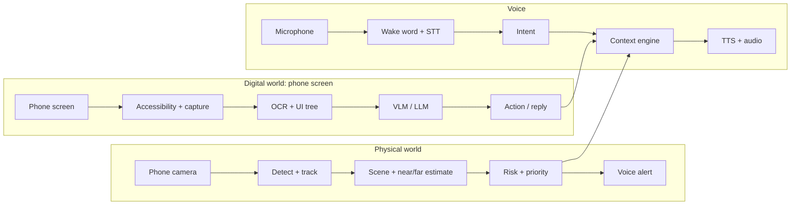

# 📱 AI Assistive Vision & Navigation System — Full Project Roadmap
### Team of 6 · 6-Month Build · Android App + Phone Camera Only

---

## 1. Project Overview

**What it is:** An Android voice assistant for blind and low-vision users. It sees the world through the **phone camera**, reads the **phone screen**, navigates by voice, and speaks back through an open-ear headset. The whole system is controlled by voice, with no need to look at a screen.

**What makes it more than "a camera with TTS":**
- It **understands** the scene: obstacles, vehicles, people, text, banknotes.
- A **context and priority engine** decides what is worth saying, so the user hears one calm voice instead of a stream of labels.
- It reads and navigates **other apps** (WhatsApp, Facebook) through the Android Accessibility API.
- Safety-critical alerts run **on the phone** and keep working with no internet.

**Core rule:** the priority engine is the product. Every detection becomes an event with a risk score. Only events above the current threshold are spoken, and anything the user is already hearing is not repeated.

**Target users:**
- Primary: **blind and low-vision users** who want hands-free awareness of surroundings and phone content.
- Presented honestly as a **research prototype and assistive aid**, not a certified medical device and not a replacement for a white cane or guide.

**The iPhone problem:** the whole team uses iPhones, but screen understanding only works on Android (iOS blocks other apps from reading or controlling third-party screens). Decision: buy at least one dedicated Android test phone in week 1. Everyone else can develop the backend, CV models and prompts on laptops.

**Main use cases:**

| Use case | Description | Priority |
|---|---|---|
| Obstacle and vehicle warning | Detect, track, warn left/right, approaching-vehicle alert | 🟢 |
| Scene description / look-and-ask | "What's around me?", free-form questions via cloud VLM | 🟢 |
| OCR | Signs, menus, documents, medicine labels | 🟢 |
| Voice assistant | Wake word, commands, rule-based fast path | 🟢 |
| Navigation and SOS | Walking turn-by-turn, SMS with location | 🟢 |
| Screen understanding | Open app, read screen, scroll, summarize a post | 🟢 |
| WhatsApp / notification reading | Notification listener, read-only | 🟢 |
| Known-person recognition | Opt-in enrollment, unknown person announced generically | 🟡 |
| Currency recognition (EGP) | Needs own dataset | 🟡 |
| Reels / video content | VLM on a screenshot, no audio | 🟡 |
| Send or reply to messages | Risky, needs confirmations | 🔴 Future |
| Stair detection | Needs reliable depth sensing | 🔴 Future |

---

## 2. MVP Definition

**Single deliverable:** an Android app plus a small FastAPI backend that detects hazards, reads text, answers questions about what the camera sees, reads the phone screen, navigates by voice, and sends an SOS, controlled entirely by voice.

**Explicitly NOT in scope:**
- Any glasses, frames, extra sensors or custom hardware.
- Free control of every app, or any control of banking and secure screens.
- Metric depth or exact distances from a single phone camera.
- Vehicle speed or time-to-collision from one camera.
- Cloud-grade AI running fully offline.
- Any safety guarantee in traffic.

**Post-MVP roadmap:**
- Send/reply to messages by voice (with spoken confirmation).
- Depth sensing for stairs and drops.
- Indoor navigation with beacons.
- First-class Arabic and Egyptian-dialect speech.
- Wearable form factor (glasses) as a future funding step.

---

## 3. System Architecture



**Three pipelines, one shared context engine** that decides what the user hears.

**Local vs cloud rule:** anything safety-critical or high-frequency (obstacles, vehicles, wake word, SOS) runs on the phone. Anything needing deep reasoning (scene description, screen summaries, translation) goes to the cloud.

| Component | On phone | Backend (FastAPI) | Cloud AI |
|---|---|---|---|
| Camera capture, frame sampling | ✅ | | |
| Object, person, vehicle detection + tracking (15-25 FPS) | ✅ | | |
| Risk and priority engine, alert queue | ✅ | | |
| Wake word, emergency keywords | ✅ | | |
| OCR (ML Kit) and QR | ✅ | | Fallback for hard or Arabic text |
| Face detection and embedding | ✅ | Known-people DB sync | |
| Scene description, look-and-ask | | Orchestrates, stores history | VLM API |
| Voice intent and LLM reasoning | Simple rules | Intent routing | LLM API |
| Screen understanding | Accessibility tree + screenshot | Prompt assembly | VLM/LLM summary |
| GPS, maps, turn-by-turn | Location, TTS | Directions proxy and cache | Maps API |
| SOS | SMS, call, location | Optional emergency contact push | |
| Users, faces, settings, logs | SQLite cache | PostgreSQL + pgvector | |

**Risk levels:**
- **Critical** (vehicle approaching, SOS): interrupts anything.
- **Warning** (obstacle ahead, person close): spoken at the next gap.
- **Info** (scene description, text, notifications): spoken only when asked, or when the user is idle and stationary.

**Fallback with no internet:** safety alerts, OCR, already-loaded navigation and SOS keep working. Only VLM answers and screen summaries are disabled, and the assistant says so.

---

## 4. AI Components

### Computer Vision and On-Device ML

| Component | Why needed | Recommended model | Where | Latency |
|---|---|---|---|---|
| Object / person / vehicle detection | Core hazard awareness | **YOLO nano-class** (YOLO11n/26n), fine-tuned, exported to LiteRT/ONNX | Phone GPU/NPU | 30-70 ms/frame, 15-25 FPS |
| Tracking + approaching vehicle | "Car from the right" | ByteTrack-style tracker + bounding-box growth rate | Phone CPU | < 5 ms |
| Obstacle distance | Coarse near/far, not meters | Bounding-box size heuristic, optional Depth Anything V2-small | Phone GPU | 100-300 ms (depth) |
| Face detection + recognition | Known-person names | ML Kit face detection + MobileFaceNet/ArcFace-style embedding, cosine match | Phone; embeddings in pgvector | 50-150 ms |
| OCR | Signs, menus, medicine labels | **ML Kit Text Recognition**; cloud VLM for hard text | Phone | 100-400 ms |
| Currency | EGP notes | Fine-tuned MobileNetV3-class classifier | Phone | < 50 ms |
| Color | "What color is this" | HSV analysis, VLM when asked | Phone / cloud | < 20 ms / 1-3 s |

**Notes:**
- YOLO nano models are AGPL. Check the license, or use an Apache-licensed detector.
- Without a distance sensor, obstacle distance is **relative only** (near / medium / far). Never claim meters.

### Speech, NLP and LLM

| Component | Choice | Notes |
|---|---|---|
| Wake word | openWakeWord or Porcupine custom keyword | < 200 ms, false triggers in noise |
| Speech-to-text | Android on-device recognizer first; Whisper-class via backend as upgrade | Better for Egyptian Arabic and English mixing |
| Intent | Rules + small LLM call for free-form commands | Keep a rule-based fast path for emergencies |
| Scene / screen reasoning | Hosted multimodal API (Claude, Gemini or similar) via backend | 1.5-4 s, can hallucinate: informational use only, never safety-critical |
| Text-to-speech | Android offline TTS for alerts; neural cloud TTS for long reading | Offline Arabic voices vary by phone |
| Embeddings + vector search | pgvector in PostgreSQL | Only for known faces and saved places |

**Do not build:** recognition of arbitrary strangers by name, metric depth from one RGB camera, accurate vehicle speed from one camera.

---

## 5. Screen and App Interaction Architecture

Android makes this realistic through an **AccessibilityService**; iOS does not. It works app by app, not universally.

**Perception ladder (cheapest and most reliable first):**
1. **Accessibility node tree:** exact text, buttons, scroll containers. Free, offline.
2. **Screenshot + on-device OCR (ML Kit):** when nodes are empty or unlabeled.
3. **Screenshot + cloud VLM:** when layout, images or video frames matter.

**Voice command flow:**
1. Wake word + STT produce the command ("open Facebook and tell me about this post").
2. Intent parser maps it to an action list: launch app, wait for screen, read screen, summarize.
3. Launch intent opens the app; the service waits for the window to settle.
4. The service captures the node tree and, if needed, a screenshot.
5. Backend builds the prompt and calls the LLM/VLM.
6. TTS speaks the answer. Follow-ups ("scroll down") repeat from step 4.

**Capability classes:** 1 Fully possible · 2 Possible with user permission · 3 Possible through Accessibility APIs · 4 Only in our own controlled prototype · 5 Not realistically possible.

| Capability | Android | iPhone |
|---|---|---|
| Open an app by voice | 1 | 2 |
| Read notifications and new WhatsApp messages | 2 | 5 |
| Read visible screen text | 3 | 5 |
| Describe or summarize a screen | 2-3 | 4 |
| Scroll, back, tap a labeled button | 3 | 5 |
| Reel / video content (visible frame + caption) | 2-3 | 5 |
| Book reading inside our own reader | 4 | 4 |
| Send messages on the user's behalf | 3 (keep read-only in MVP) | 5 |
| Banking and password screens (`FLAG_SECURE`) | 5 | 5 |
| Games and unlabeled custom UIs | 5 | 5 |
| Controlling any app freely and silently | 5 | 5 |

**Safety rules for the demo:**
- Announce every action before performing it.
- Never tap send, delete, buy or pay without explicit spoken confirmation.
- Never read password or banking screens.
- Warn the user that screen content is sent to a cloud model.

**Policy reality:** Google Play only accepts Accessibility use mainly for people with disabilities. For the graduation project, **distribute a sideloaded APK** (enable "restricted settings" manually). Meta apps forbid automated scraping and change UIs freely, so build the demo on a personal account, one user, assistive use only.

---

## 6. Phone Setup and Accessories

No custom hardware. The project needs one good Android phone and a few cheap accessories.

| Item | Purpose | Qty | EGP (approx.) | Essential? |
|---|---|---|---|---|
| Mid-range Android phone (Snapdragon 7-series or Dimensity 8000-class, 8 GB RAM) | Camera, NPU, GPS, screen control, main dev device | 1 | 8,000-18,000 | Essential |
| Second Android phone (cheaper) | Parallel dev, demo backup | 1 | 5,000-10,000 | Recommended |
| Open-ear or bone-conduction headset | Audio without blocking street sound | 1 | 750-2,500 | Essential |
| Chest or neck phone mount / lanyard | Stable, forward-facing camera position for testing | 1 | 400-1,000 | Essential |
| Power bank (10,000 mAh) + cables | Long test sessions | 1 | 750-1,500 | Essential |
| Printed test material (signs, banknote copies, documents) | Demo and dataset collection | set | 250-500 | Essential |

**Minimum phone:** Android 13+ (14+ preferred), Snapdragon 7-series or Dimensity 8000-class, 8 GB RAM, 128 GB storage, 12 MP camera with autofocus, battery ≥ 4,500 mAh, stable thermals in 30-minute sessions. **Verify with a benchmark app in month 1.**

**Cloud and API cost:** roughly 30-120 USD per month during development and demo (mostly VLM calls and a small VPS). Keep it low by sending small compressed images (512-768 px), caching repeated answers, setting hard spending limits on every API key, and using a mock backend for development.

---

## 7. Team of 6 — Responsibilities

| Member | Strengths | Role |
|---|---|---|
| **Mostafa Moko** | OCR, YOLO | Computer vision: detection, tracking, OCR, near/far estimate, on-phone model optimization |
| **Boda** | LLM, TTS, STT | Voice stack, intents, VLM/LLM prompts; pairs on the Android voice flow |
| **Mostafa Sayed** | Backend | FastAPI backend, Docker, deployment; Android lead (provisional) |
| **Mahmoud** | Databases, analysis, ML, DL | Database, datasets and labeling, training and evaluation |
| **Marwan** | AI diploma | Priority engine, navigation, audio and haptic cues, currency and face models |
| **Loay** | Adaptable | Integration, test devices, QA, field tests, mock screens, demo, documentation |

**Open gap:** Android/Kotlin experience (the heart of the project) must be settled in month 1. Two people should write Kotlin. See `TEAM_TASKS_EN.md` for every person's step-by-step tasks and who waits for whom.

**Pairing:**
- Mostafa Sayed and Boda pair on Android.
- Marwan and Mostafa Moko pair on events and the engine.
- Mahmoud and Loay pair on datasets, evaluation sets and test scenarios.
- Hold a short **weekly integration demo** so nobody works for months on something that does not connect.

---

## 8. Team Workflow

```
main               → always deployable, tagged at each phase gate
develop            → integration branch
feature/cv-*       → Mostafa Moko
feature/voice-*    → Boda
feature/backend-*  → Mostafa Sayed
feature/android-*  → Mostafa Sayed / Boda
feature/data-*     → Mahmoud
feature/engine-*   → Marwan
feature/test-*     → Loay
```

- Branch naming: `feature/<area>-<short-description>`.
- **PRs required** to merge into `develop`, reviewed by someone from another role.
- **Merge cadence:** into `develop` at least twice a week; `develop` → `main` at each phase gate.
- **Freeze the Must Have list in month 1**, review monthly, no new features before Gate 4.
- **Contracts:** freeze the event schema and the backend API by end of week 2 in `docs/api-contract.md`.
- **Model formats:** LiteRT/ONNX. Keep raw checkpoints out of Git; use Git LFS or a download script.
- **Secrets:** one `.env.example`; hard spending limits on every API key; a **mock backend** so only integration tests and demos spend real money.
- **Tooling:** GitHub, Roboflow or CVAT, Weights & Biases.

---

## 9. GitHub Repository Structure

```
assistive-vision-nav/
│
├── README.md
├── TEAM_TASKS_EN.md
├── .gitignore
├── .env.example
├── docker-compose.yml
│
├── android/                # Kotlin app: camera, accessibility, SOS, voice flow
│   ├── app/
│   └── tests/
│
├── engine/                 # Priority engine, alert queue
├── navigation/             # Maps, turn-by-turn, audio and haptic cues
│
├── computer_vision/        # Detection, tracking, OCR eval, currency, faces
│   ├── training/
│   ├── export/
│   └── models/             (gitignored, see models/README.md)
│
├── backend/                # FastAPI
│   ├── main.py
│   ├── routers/
│   ├── services/
│   └── tests/
├── nlp/                    # Prompts, intents, STT/TTS glue
│   └── prompt_templates/
│
├── datasets/               # Sample data, labeling guidelines, download scripts
├── tests/                  # E2E, field-test logs, mock screens
│
└── docs/
    ├── architecture.md
    ├── api-contract.md
    ├── screen-capabilities.md
    └── demo-script.md
```

---

## 10. Data Flow and Context Engine

**Event schema (CV → engine), freeze early:**

```json
{
  "id": "evt_0142",
  "source": "camera",
  "type": "vehicle_approaching",
  "label": "car",
  "side": "right",
  "distance_band": "near",
  "confidence": 0.87,
  "risk": "critical",
  "timestamp": 1760000000.123
}
```

`distance_band` is `near`, `medium` or `far` (relative, never meters).

**Engine rules:**
1. Every detection becomes an event with a risk score.
2. Only events above the current threshold are spoken.
3. **Critical** interrupts anything. **Warning** waits for the next gap. **Info** waits for a question or an idle, stationary user.
4. Cooldowns prevent repeats of the same event.
5. Everything is logged. The final demo shows the alert log, including what the engine chose **not** to say.

---

## 11. Backend API (draft)

| Endpoint | Purpose |
|---|---|
| `GET /health` | Liveness check |
| `POST /describe` | Frame → short scene description (VLM) |
| `POST /ask` | Frame + question → answer (look-and-ask) |
| `POST /screen/summarize` | Screen text/tree (+ optional screenshot) → summary |
| `POST /intent` | Free-form command → action list |
| `POST /faces/enroll` | Opt-in face enrollment (embedding only) |
| `POST /faces/match` | Embedding → known person or "unknown" |
| `GET /route` | Walking directions proxy with cache |
| `POST /sos` | Optional emergency contact push |

All endpoints return a bounded response and a fallback message on timeout, never a crash.

---

## 12. Development Phases (6 gates)

| Phase | Months | Goal | Gate (must be demonstrable) |
|---|---|---|---|
| 1. Foundation | 1 | Repo, backend skeleton, Android shell, phone benchmark, first datasets | Camera to speech works |
| 2. Vision basics | 1-2 | YOLO on phone, OCR, TTS, risk rules v1 | Detect, warn, read text |
| 3. Voice + VLM | 2-3 | Wake word, STT, intents, cloud VLM, look-and-ask, known-people DB, engine v2 | Voice asks scene + faces |
| 4. Screen + nav | 3-4 | Accessibility reading, scroll, notifications, Maps turn-by-turn, SOS | **Complete demo works on the phone** |
| 5. Polish + field tests | 4-5 | Currency, Reels, stability, battery and thermal tests, field tests with volunteers | 30-minute session is stable |
| 6. Test + demo | 5-6 | Bug fixing, freeze, rehearsals, thesis and video | Feature freeze, final demo |

---

## 13. Six-Month Timeline

| Month | Mostafa Moko | Boda | Mostafa Sayed | Mahmoud | Marwan | Loay |
|---|---|---|---|---|---|---|
| 1 | YOLO baseline, sample events | STT/TTS prototype, API keys | Mock backend, Docker, Android shell | Guidelines, DB schema | Event JSON, engine design | **Buy phones/accessories**, repo, field videos |
| 2 | Fine-tune, export, OCR eval | Prompts, intents, wake word | `/describe`, CameraX, run YOLO | Labeling, eval sets | Engine v1, currency | Test-device setup, test plan |
| 3 | Tracking, near/far estimate | Voice flow in the app | Deploy, DB, Accessibility | Currency/face training | Engine v2, faces, navigation | Weekly demos, mock screens |
| 4 | Night tuning, optimization | Screen prompts | Notifications, SOS | Alert log analysis | Turn-by-turn, audio/haptic cues | Build regression checks |
| 5 | Battery/thermal tuning | Evaluation, translation | APK + stability | Field-test analysis | Tuning, privacy note | Field tests, battery logs |
| 6 | Freeze models | Freeze prompts | Freeze API/app | Final report | Freeze engine | Demo script, thesis |

---

## 14. Dataset Strategy

Mostly **pretrained models with light fine-tuning**. Never train from scratch.

| Task | Data | Notes |
|---|---|---|
| Obstacles, vehicles, people | COCO-pretrained base + **own Egyptian street videos** | Daylight first, then low light |
| Stairs / drops | Own data only | Future tier |
| EGP currency | **Own dataset**: all denominations, both sides, worn notes, varied light | No reliable public set |
| Faces | Opt-in enrolled volunteers only | Store embeddings, not images; encrypted and opt-in |
| OCR | ML Kit pretrained | Test on Egyptian signs, menus, medicine boxes; Arabic is weaker |
| Screen understanding | Mock messaging screens + tested real apps | Evaluation, not training |

---

## 15. Model Selection

| Model | Task | Where | Advantages | Disadvantages | Recommended? |
|---|---|---|---|---|---|
| YOLO nano-class | Detection | Phone GPU/NPU | Fast, easy export | AGPL license, small objects, night | ✅ Yes |
| ByteTrack-style | Tracking | Phone CPU | < 5 ms | Needs steady FPS | ✅ Yes |
| ML Kit Text Recognition | OCR | Phone | Free, offline for Latin | Arabic and handwriting weaker | ✅ Yes (+ cloud fallback) |
| ML Kit Face + MobileFaceNet/ArcFace | Faces | Phone | Fast, local | Angles, low light, model licenses | ✅ Yes (opt-in) |
| MobileNetV3-class | Currency | Phone | Tiny, fast | Needs own dataset | ✅ Yes |
| Depth Anything V2-small | Relative depth | Phone GPU | No extra hardware | Relative only, 100-300 ms, battery | 🟡 Optional |
| Hosted VLM/LLM | Scene, screen, intent | Cloud | Best reasoning | Internet, API cost, hallucination | ✅ Yes (informational only) |
| openWakeWord / Porcupine | Wake word | Phone CPU | Offline, small | False triggers, battery | ✅ Yes |
| Android STT / Whisper-class | Speech to text | Phone / backend | Free / better Arabic mix | Street noise | ✅ Yes |
| Android TTS / neural cloud TTS | Speech | Phone / cloud | Offline alerts / nicer reading | Arabic voices vary | ✅ Yes |

---

## 16. Performance Requirements (MVP targets)

| Metric | Target |
|---|---|
| Detection | 15-25 FPS, 30-70 ms/frame on the test phone |
| Tracking | < 5 ms per frame |
| OCR | 0.1-0.4 s per frame |
| Face match | 50-150 ms per face |
| Wake word | < 200 ms |
| Scene / screen answer (cloud) | 1.5-4 s |
| Critical alert (vehicle) | Spoken with no cloud dependency |
| Phone sessions | Stable thermals for 30 minutes |

**Battery levers:** reduce frame rate when the user is standing still, wake the full pipeline on motion, always demo with a power bank, check temperature after 20-30 minutes of continuous use.

---

## 17. Testing Strategy

- **Unit tests:** priority engine (thresholds, cooldowns, interrupts), intent parser, tracker, prompt builders.
- **Model tests:** fixed labeled sets for vehicles, text, banknotes; accuracy and latency report per device.
- **Integration tests:** CV → engine event schema; Android ↔ backend.
- **API tests:** `pytest` + `httpx` with valid/invalid payloads and timeouts.
- **Screen tests:** 2-3 tested apps on one phone model; mock WhatsApp screen as fallback; freeze OS updates before the demo.
- **Failure modes:** no internet, empty frame, VLM timeout, low battery, headset disconnected.
- **Field tests:** visually impaired volunteers on pre-tested routes (written consent). Log every alert to tune false alarms and misses.
- **E2E:** all demo steps run at least 3 times back-to-back.

---

## 18. Technical Risks

| Risk | Likelihood | Impact | Mitigation and fallback |
|---|---|---|---|
| Team has only iPhones | High until fixed | High | Buy the Android test phone in week 1 |
| Accessibility Service differs per app/version | High | Medium | Demo on 2-3 tested apps, OCR + screenshot fallback |
| Meta apps change UI or block automation | Medium | Medium | Read-only, notification listener, mock messaging screen |
| Low detection accuracy outdoors or at night | High | High | Local data, daylight first, conservative thresholds, no safety claims |
| Phone camera position keeps changing | Medium | Medium | Chest/neck mount, fixed test position, document it |
| No real distance sensing | High | Medium | Near/medium/far only, never meters |
| False alarms or missed alerts erode trust | High | High | Cooldowns, volunteer tests, log every alert |
| VLM hallucination | Medium | Medium | Informational only, "I may be wrong" phrasing |
| No internet at the demo venue | Medium | High | Phone hotspot, offline safety path, recorded backup video |
| Phone overheats or battery drains | High | Medium | Frame-rate scaling, power bank, thermal logging |
| Arabic/Egyptian dialect weak | Medium | Medium | English commands in the demo, Arabic as stretch |
| Privacy and ethics (faces, camera, screen data) | Medium | High | Opt-in faces, consent notices, no image storage by default, ethics note |
| Scope creep | High | High | Freeze Must Have in month 1, monthly review |
| Medical or safety claims | Medium | High | Present as research prototype and assistive aid only |

---

## 19. Demo Scenarios (scripted, 8-10 minutes)

Use controlled indoor stations and a pre-tested route, with the phone on a chest mount. Keep a recorded backup video of every step and a projector view of the alert log.

1. **Wake and look:** wake word, "What's around me?" → short scene description.
2. **Obstacle:** walk toward a chair; warning with a near/medium/far band, left/right cue and a phone vibration pulse.
3. **Priority engine:** crowded room; only the important item is spoken, the log shows the rest suppressed.
4. **Approaching vehicle:** toy car or recorded video from the right; critical alert interrupts everything. Never stage near real traffic.
5. **Reading:** sign, menu, medicine box; then an EGP banknote (if finished).
6. **Known person:** enrolled volunteer is named; unknown person announced as "someone you don't know".
7. **Navigation:** "Take me to the nearest pharmacy" → short pre-tested route.
8. **Screen understanding:** "Open WhatsApp and read my new messages", "scroll down", "summarize these"; then summarize one Facebook post.
9. **SOS:** voice SOS sends an SMS with location to a team phone, with a spoken countdown to cancel.
10. **Offline:** airplane mode on; the phone still detects and warns, then reconnect and answer a cloud question.

**Backup plan:** second charged phone, hotspot, recorded video of each step, mock-mode WhatsApp screen.

---

## 20. Feature Priority (51-feature sheet, phone-only)

| Tier | Work package |
|---|---|
| 🟢 Must | Detection pipeline with near/far estimate; approaching vehicle alert (box growth + side, no speed claim) |
| 🟢 Must | Scene description, VQA, "what am I looking at", "what's around me" (one VLM pipeline) |
| 🟢 Must | OCR: documents, signs |
| 🟢 Must | Voice stack: assistant, emergency command, wake word, custom commands |
| 🟢 Must | GPS navigation, turn-by-turn audio |
| 🟢 Must | Priority engine, SOS, multi-level warnings |
| 🟢 Must | Cloud AI mode, WhatsApp and notification reading |
| 🟡 Should | Face recognition, known people, unknown person |
| 🟡 Should | Motion detection, path awareness (tracking-based) |
| 🟡 Should | Haptic feedback via phone vibration, voice preferences |
| 🟡 Should | Smart reading, summarization, translation, look-and-ask variants |
| 🟡 Should | Counting, color, menu, QR, medicine label reading (read only) |
| 🟡 Should | Currency recognition (own EGP dataset) |
| 🟡 Should | Caller identification, fall detection from phone IMU (needs false-alarm tuning) |
| 🔴 Future | Stair detection |

**Removed because they need custom hardware:** physical controls and capture button on glasses, glasses battery monitoring, ToF/LiDAR distance, on-glasses offline detection.

**Not realistic, do not spend time on:** free/silent control of any app, bypassing capture protection on banking apps, vehicle speed or time-to-collision from one camera, metric depth from one RGB camera, guaranteeing traffic safety, naming arbitrary strangers.

---

## 21. Final Deliverables Checklist

### AI / Computer Vision
- [ ] Detection model fine-tuned, exported and benchmarked on the test phone
- [ ] Tracking and approaching-vehicle logic documented
- [ ] OCR evaluated on Egyptian signs, menus, medicine labels
- [ ] Currency and face models (if in scope) with accuracy reports

### Backend
- [ ] `/describe`, `/ask`, `/screen/summarize`, `/intent`, `/health` implemented
- [ ] Fallbacks and timeouts on every call; mock mode working
- [ ] Dockerfile / docker-compose working
- [ ] Cost limits set; API contract in `docs/api-contract.md`

### Android
- [ ] Camera pipeline, voice flow, wake word
- [ ] Accessibility reading, scroll, back; notification reading
- [ ] SOS with countdown and location
- [ ] Signed sideloadable APK and permissions guide

### Engine and Navigation
- [ ] Priority engine with unit tests, cooldowns, alert log view
- [ ] Turn-by-turn navigation on a pre-tested route
- [ ] Audio and haptic cues

### Testing and Docs
- [ ] Battery and thermal report for a 30-minute session
- [ ] Field-test report with volunteers
- [ ] Ethics and privacy note in the thesis
- [ ] Demo script and backup videos

### GitHub
- [ ] README (Section 23 content)
- [ ] `docs/architecture.md`, `docs/api-contract.md`, `docs/demo-script.md`
- [ ] Tests passing, at least one E2E run recorded
- [ ] `v1.0` tagged release

---

## 22. Future Improvements (post-MVP)
- Send and reply to messages by voice with spoken confirmation.
- Depth sensing for stairs, drops and real distances.
- Indoor navigation with beacons and better routing.
- First-class Arabic and Egyptian-dialect support.
- Wearable version (glasses, extra sensors, on-device NPU) as a funding step.
- User studies with visually impaired volunteers at larger scale.

---

## 23. README.md (ready to paste into GitHub)

````markdown
# 📱 AI Assistive Vision & Navigation System

An Android voice assistant for blind and low-vision users that sees the world through the phone camera, reads the phone screen, navigates by voice and sends an SOS, all hands-free.

> Research prototype and assistive aid. Not a certified medical device and not a replacement for a white cane or guide.

## Problem Statement
Blind and low-vision users need hands-free awareness of obstacles, vehicles, text and their phone screen without relying on a visual interface. This project explores an audio-first assistant that speaks only what matters.

## Features
- 🟢 Obstacle, person and vehicle detection with left/right cues
- 🟢 Approaching-vehicle alert (tracked box growth, no speed claim)
- 🟢 Scene description and look-and-ask (cloud VLM)
- 🟢 OCR for signs, menus, documents and medicine labels
- 🟢 Wake word and voice assistant with a rule-based fast path
- 🟢 Walking turn-by-turn navigation and SOS with location
- 🟢 Screen understanding: open apps, read screen, scroll, summarize a post
- 🟢 WhatsApp and notification reading (read-only)
- 🟡 Known-person recognition (opt-in), EGP currency recognition

## System Architecture
Three pipelines (physical world, phone screen, voice) feed **one context and priority engine** that decides what the user hears. See `docs/architecture.md`.

## Technologies
Kotlin, Jetpack Compose, CameraX, AccessibilityService, LiteRT/ONNX, ML Kit, Python 3.12, FastAPI, PostgreSQL + pgvector, Docker.

## AI Models
- Detection: YOLO nano-class, fine-tuned (check license)
- Tracking: ByteTrack-style
- OCR: ML Kit Text Recognition (+ cloud fallback)
- Faces: ML Kit + MobileFaceNet/ArcFace-style embeddings
- Currency: MobileNetV3-class classifier
- Reasoning: hosted multimodal VLM/LLM via backend
- Wake word: openWakeWord or Porcupine
- Speech: Android STT/TTS, Whisper-class upgrade

## Requirements
- Android 13+ phone, 8 GB RAM, Snapdragon 7-series or Dimensity 8000-class
- Open-ear headset, chest or neck phone mount, power bank

## Installation
```bash
git clone https://github.com/<your-org>/assistive-vision-nav.git
cd assistive-vision-nav
cp .env.example .env   # fill in API keys
docker compose up -d   # backend + database
```

## Environment Variables
```
VLM_API_KEY=
VLM_PROVIDER=anthropic   # or gemini
MAPS_API_KEY=
DATABASE_URL=postgresql://...
MOCK_MODE=false          # true = no paid API calls
```

## Running the Project
```bash
# Backend
cd backend && uvicorn main:app --reload

# Android: open android/ in Android Studio, install the debug APK on the test phone,
# then enable the Accessibility Service and "restricted settings" manually.
```

## API Usage
See `docs/api-contract.md` (`/describe`, `/ask`, `/screen/summarize`, `/intent`, `/health`).

## Team Structure
| Member | Role |
|---|---|
| Mostafa Moko | Computer Vision (YOLO, OCR, tracking) |
| Boda | Voice and LLM (STT, TTS, prompts, intents) |
| Mostafa Sayed | Backend and Android lead |
| Mahmoud | Database, datasets, model training and evaluation |
| Marwan | Priority engine, navigation, currency and face models |
| Loay | Integration, testing, field tests and demo |

## GitHub Workflow
`main` (stable) ← `develop` (integration) ← `feature/*`, PR + review required to merge into `develop`.

## Project Roadmap
Six phases, six gates, six months. Complete phone demo at month 4, then polish and field tests.

## Privacy and Safety
- Camera frames and screen content are sent to a cloud model only when needed, with a consent notice.
- No image storage by default; face enrollment is opt-in and stored as encrypted embeddings.
- Never reads password or banking screens; asks for spoken confirmation before send, delete, buy or pay.

## Limitations
Prototype-grade; depends on internet for VLM answers and screen summaries; screen features work app by app on Android only; distance is relative (near/medium/far), not metric; detection accuracy drops at night and in unusual scenes; battery and thermal limits apply; not a safety guarantee in traffic.

## Future Improvements
Voice replies to messages, depth sensing for stairs, indoor navigation, Arabic dialect support, a wearable version.

## License
MIT (check third-party model licenses, including AGPL detectors)
````
