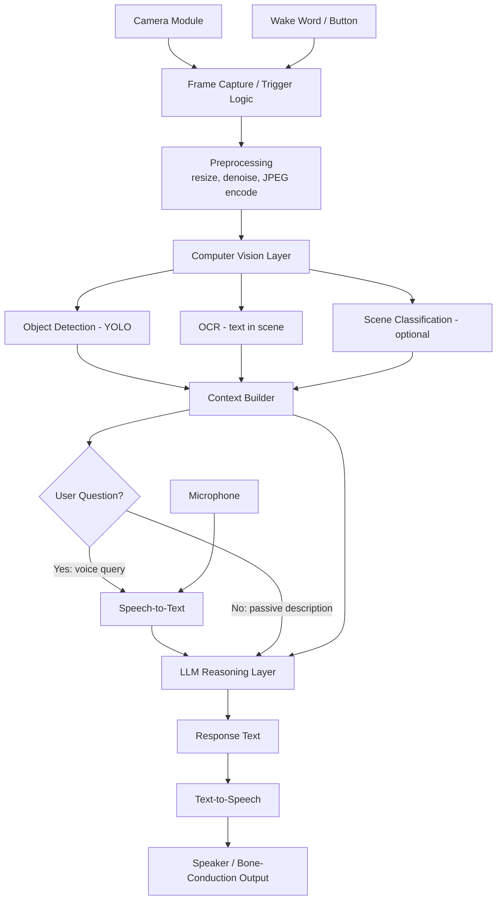

# 🕶️ AI-Powered Smart Glasses — Full Project Roadmap
### Team of 5 · 8–12 Week Build · Portfolio-Grade

---

## 1. Project Overview

**What it is:** A pair of camera-equipped glasses that continuously (or on-demand) look at what the wearer is looking at, run computer vision + a light reasoning layer on the captured frames, and speak back useful information through a small speaker or earpiece — no screen involved.

**What makes it "AI-powered" (and not just "a webcam on your face"):**
- It doesn't just record — it *understands* the scene (what objects/text/people are present).
- It uses a language model to turn raw detections into a natural, useful sentence instead of a robotic label dump ("bottle, 0.91" → "There's a water bottle on the table to your left").
- It can answer free-form questions about what it's currently seeing ("What does this label say?", "Is this crosswalk clear?").

**Target users (pick a primary persona — don't try to serve all of them):**
- Primary (recommended): **sighted users who want hands-free scene information** — reading small text, identifying products, getting quick descriptions while their hands are busy.
- Also realistic as a secondary framing: **early-stage accessibility aid** for low-vision users (this is the most emotionally compelling demo narrative, but do NOT market it as a certified assistive device — it's a prototype).

**Main use cases (choose 3–4 for MVP, not all):**
| Use case | Description | MVP? |
|---|---|---|
| Scene description | "What am I looking at?" | 🟢 |
| Text reading (OCR) | Read signs, labels, menus aloud | 🟢 |
| Object finding | "Where is my phone?" | 🟡 |
| Voice Q&A about the scene | Free-form question answered using the current frame | 🟡 |
| Face recognition ("who is this") | 🔴 optional — privacy-sensitive, skip for MVP |
| Navigation / obstacle warning | 🔴 optional — needs depth + safety guarantees you can't give in a student project |

---

## 2. MVP Definition

**MVP (must ship, ~8–10 weeks):**
1. Press a button (or say a wake word) → capture a frame.
2. Run object detection + OCR on that frame.
3. Build a short text description from the detections.
4. Send it to an LLM to phrase a natural one/two-sentence answer.
5. Convert to speech and play through a speaker.
6. All of this end-to-end, on a Raspberry Pi (or phone), demoable live.

**Explicitly NOT in MVP:** continuous real-time video narration, face recognition, GPS navigation, custom-trained models, multi-user accounts, cloud dashboard, mobile app store release.

**Post-MVP roadmap (only after MVP works end-to-end):**
- Wake-word activation instead of button.
- Conversation memory (follow-up questions about the same frame).
- On-device (offline) fallback mode.
- Depth estimation for "how far is it."
- Companion mobile app for settings/history.

---

## 3. System Architecture



**Essential components:** Camera, Frame Capture, Object Detection, Context Builder, LLM (or template fallback), TTS, Speaker.
**Optional components:** OCR (only if reading text matters to your demo), Scene Classification (nice-to-have, skip if time-poor), Speech-to-Text (only needed if you support spoken questions vs. a single button press), Depth Estimation, Face Recognition.

---

## 4. AI Components

### Computer Vision

| Component | Why needed | Input | Output | Recommended model | Lightweight alt | Runs where |
|---|---|---|---|---|---|---|
| Object Detection | Core scene understanding — tells you *what* is present and *where* | RGB frame | Bounding boxes + class labels | **YOLOv8n** (nano) | YOLOv5n, MobileNet-SSD | Local (Pi/Jetson) |
| OCR | Reading text (signs, labels, menus) 🟢 must-have for a compelling demo | RGB frame / cropped region | Extracted text strings | **PaddleOCR (mobile/lite model)** | Tesseract OCR | Local, or API (Google Vision) as fallback |
| Scene Classification | 🟡 nice context ("you're in a kitchen") | RGB frame | Scene label | **MobileNetV3 (Places365 fine-tune)** | Skip entirely — LLM can often infer this from detected objects | Local |
| Object Tracking | 🔴 only needed for continuous video, not single-frame MVP | Sequence of frames | Object IDs across frames | ByteTrack | — | Local |
| Depth Estimation | 🔴 optional; adds real complexity for MVP | RGB frame | Depth map | MiDaS-small | — | Local (heavy) — usually skip |

**Do not build:** face recognition or depth estimation for the MVP demo. They add privacy/ethics overhead (face rec) and computational cost (depth) disproportionate to what a student MVP needs to prove.

### NLP / LLM

You need an LLM layer, but **only as a phrasing/reasoning layer, not for detection.** Detection stays entirely in computer vision.

| Question | Answer |
|---|---|
| Do we need an LLM? | 🟢 Yes — turns "bottle(0.91), table(0.88)" into a natural sentence, and answers free-form questions about the scene. |
| Do we need BERT specifically? | 🔴 No. BERT is for embeddings/classification tasks, not generation. Not needed here. |
| Do we need RAG? | 🔴 No, unless you add a "remember what I've seen" feature later. Out of scope for MVP. |
| Do we need embeddings? | 🟡 Only if you build the "where did I leave my keys" object-memory feature later — not MVP. |
| Do we train our own LLM? | 🔴 Absolutely not. Use an API. |

**Recommendation:** Call the Claude or GPT API with a structured prompt: "You are narrating a scene for a smart-glasses wearer. Detected objects: [...]. OCR text: [...]. User question (if any): [...]. Respond in one or two short spoken sentences." This is cheap, fast to build, and far more reliable than trying to fine-tune anything.

- **Speech-to-Text (if supporting spoken questions):** OpenAI Whisper (tiny/base model) — runs locally, no need for cloud STT for a demo.
- **Text-to-Speech:** Piper TTS (fully offline, fast, natural-sounding, runs on a Pi) is the recommended choice; cloud TTS (ElevenLabs / Google TTS) as a "nicer voice" fallback if you have internet at demo time.

---

## 5. Hardware Architecture

**Essential flow:** Camera → Compute unit → (local inference and/or API calls) → Speaker, with a mic for input if voice questions are supported.

### MVP Hardware
- Raspberry Pi 4 (4GB) or a mid-range Android phone repurposed as the compute unit
- Raspberry Pi Camera Module or a cheap USB webcam
- USB microphone (or phone's built-in mic)
- Small 3W speaker or wired earbuds
- Power bank (10,000mAh USB-C)

### Better Prototype
- Raspberry Pi 5 (8GB)
- Wide-angle Pi Camera Module 3
- MEMS I2S microphone (better noise rejection, hands-free)
- Bone-conduction speaker (keeps ears open — realistic for a wearable)
- 3.7V Li-Po battery + boost converter + charging module (instead of a bulky power bank)

### Advanced Version
- NVIDIA Jetson Orin Nano (real on-device AI acceleration, runs YOLO + OCR locally with low latency)
- Dual camera setup (stereo, for later depth estimation) or a higher-FoV module
- Bluetooth open-ear earbuds
- Custom Li-Po pack with protection circuit + fast USB-C charging
- IMU (head-orientation-aware framing, optional feature)

See the companion **Hardware BOM & Shopping List** document for exact models, EGP pricing, and where to buy each part in Egypt.

---

## 6. Team of 5 — Responsibilities

### Person 1 — Computer Vision
- **Responsibilities:** object detection, OCR, (optional) scene classification, camera capture pipeline, model optimization/quantization for edge deployment.
- **Technologies:** Python, PyTorch/Ultralytics YOLOv8, PaddleOCR/Tesseract, OpenCV, ONNX Runtime.
- **Tasks:** set up camera capture; integrate YOLOv8n; integrate OCR; benchmark FPS/latency on the target device; export/optimize models (ONNX/TFLite quantization).
- **Folders owned:** `computer_vision/`
- **Input:** raw camera frame (JPEG/array). **Output:** structured JSON — `{objects: [...], ocr_text: [...], timestamp}`.
- **Depends on:** Person 4 (camera hardware working) before real testing; provides output format to Person 3 early so the pipeline contract is fixed.
- **Deliverables:** `detect()` and `read_text()` functions/module with a documented JSON schema; benchmark report.
- **Testing:** unit tests on sample images; FPS/latency benchmark on real hardware.

### Person 2 — NLP / LLM
- **Responsibilities:** prompt design, LLM API integration, response formatting for TTS, (optional) STT integration for voice queries.
- **Technologies:** Python, Anthropic/OpenAI API SDK, Whisper (STT), Piper (TTS) or cloud TTS.
- **Tasks:** design the system prompt that turns CV JSON into natural speech; handle "no user question" (passive description) vs. "user asked X" (Q&A) modes; integrate STT if voice questions are in scope; integrate TTS output.
- **Folders owned:** `nlp/`
- **Input:** structured JSON from Person 1 (+ optional transcribed question). **Output:** final spoken-response text, and an audio file/stream.
- **Depends on:** Person 1's JSON schema (agree on it in week 1); Person 3 for how the pipeline calls this module.
- **Deliverables:** `generate_response()` function; `speak()` function; prompt templates documented in `docs/`.
- **Testing:** unit tests with mocked CV output; manual listening tests for TTS quality/latency.

### Person 3 — Backend / AI Pipeline
- **Responsibilities:** orchestration — the glue that calls CV → NLP → TTS in order; API server; state/session handling; error handling and fallbacks.
- **Technologies:** Python, FastAPI, Uvicorn, asyncio, Docker.
- **Tasks:** define and build the REST API (see Section 9); build the pipeline orchestrator; add logging, timeouts, and graceful failure ("I couldn't process that" instead of a crash); containerize the backend.
- **Folders owned:** `backend/`
- **Input:** HTTP requests from the frontend/hardware trigger. **Output:** JSON response with spoken text + audio.
- **Depends on:** Person 1 and 2's module interfaces (defined by end of week 2). Everyone else depends on this being stable.
- **Deliverables:** running FastAPI service with documented endpoints; Dockerfile/docker-compose.
- **Testing:** API integration tests (pytest + httpx), load test for repeated capture events, failure-mode tests (no internet, empty frame, no objects).

### Person 4 — Hardware / IoT
- **Responsibilities:** physical assembly, camera/mic/speaker wiring, power system, button/wake-word trigger circuit, on-device deployment (Pi OS setup, drivers).
- **Technologies:** Raspberry Pi OS, GPIO/Python (`RPi.GPIO`/`gpiozero`), soldering/wiring, basic electronics, 3D printing/CAD (optional, for enclosure/mounting).
- **Tasks:** assemble MVP hardware config; wire camera + mic + speaker + button; write the trigger script that calls the backend API on button press; measure real battery runtime; build/attach the physical mount to the glasses frame.
- **Folders owned:** `hardware/`
- **Input:** physical components. **Output:** a working physical device that calls the backend API and plays returned audio.
- **Depends on:** Person 3's API contract (needs the exact endpoint/request format).
- **Deliverables:** assembly instructions with photos; trigger script; battery-life measurement report.
- **Testing:** hardware smoke tests (camera captures, mic records, speaker plays), full end-to-end device test, battery runtime test.

### Person 5 — Frontend / Mobile / Integration
- **Responsibilities:** companion app or dashboard (for demo/debugging — showing what the glasses "see" and "say" live), overall system integration testing, documentation, demo script coordination.
- **Technologies:** React (web dashboard) or React Native/Flutter (companion mobile app) — a simple web dashboard is enough for MVP.
- **Tasks:** build a live dashboard that shows the last captured frame, detected objects, and spoken response (great for demos and debugging); coordinate integration testing across all 4 other members; own the README and final demo script; help write end-to-end tests.
- **Folders owned:** `frontend/`
- **Input:** backend API responses (via WebSocket or polling). **Output:** live web dashboard.
- **Depends on:** Person 3's API being stable enough to consume.
- **Deliverables:** working dashboard; final integration test pass; demo day script; polished README.
- **Testing:** UI smoke tests, full end-to-end system test coordination (owns this).

**Workload balance note:** Person 3 and Person 5 carry more integration/coordination weight and less deep-ML work than Person 1/2 — this is intentional and fair, since coordination is real work too. Rotate who "owns" the final demo run-through so it's not all on one person.

---

## 7. Team Workflow

**Branching model:**
```
main            → always deployable, tagged at each milestone
develop         → integration branch, merged into main after a milestone passes E2E test
feature/cv-*    → Person 1
feature/nlp-*   → Person 2
feature/backend-* → Person 3
feature/hardware-* → Person 4
feature/frontend-* → Person 5
```

- Branch naming: `feature/<area>-<short-description>`, e.g. `feature/cv-yolo-integration`.
- **PRs required** to merge into `develop` — at minimum one other teammate reviews (doesn't have to be a domain expert, just sanity-checks it runs and matches the agreed interface).
- **Merge cadence:** merge into `develop` at least twice a week; merge `develop` → `main` at the end of each development phase (Section 11) once the phase's Definition of Done is met.
- **API contracts:** freeze the CV→NLP JSON schema and the Backend REST API schema by end of Week 2 (Section 9) — document them in `docs/api-contract.md` so nobody blocks on someone else's in-progress code.
- **Data formats:** frames as JPEG (base64 in JSON, or multipart upload); detection results as JSON; audio as WAV or MP3.
- **Model formats:** ONNX for CV models (portable across the Pi and dev laptops); keep raw `.pt`/checkpoint files out of Git — use Git LFS or a shared drive link in `models/README.md`.
- **Environment management:** one `requirements.txt` (or per-folder `requirements.txt` + a root one) and a `.env.example` listing every required API key/config value, so nobody hardcodes secrets.

---

## 8. GitHub Repository Structure

```
smart-glasses-ai/
│
├── README.md
├── requirements.txt
├── .gitignore
├── .env.example
├── docker-compose.yml
│
├── backend/                # Person 3 — FastAPI orchestration service
│   ├── main.py
│   ├── routers/
│   ├── services/
│   └── tests/
│
├── computer_vision/        # Person 1 — detection + OCR
│   ├── detect.py
│   ├── ocr.py
│   ├── models/              (gitignored — see models/README.md)
│   └── tests/
│
├── nlp/                    # Person 2 — LLM + STT/TTS
│   ├── prompt_templates/
│   ├── llm_client.py
│   ├── stt.py
│   ├── tts.py
│   └── tests/
│
├── hardware/                # Person 4 — device scripts, wiring docs
│   ├── trigger.py
│   ├── wiring_diagrams/
│   └── setup_pi.md
│
├── frontend/                # Person 5 — dashboard
│   ├── src/
│   └── public/
│
├── models/                  # shared model weights (Git LFS or download script)
│   └── README.md
│
├── datasets/                 # sample images/audio for testing (small, not full training sets)
│
├── docs/
│   ├── api-contract.md
│   ├── architecture.md
│   └── demo-script.md
│
├── tests/                    # end-to-end / integration tests spanning modules
│
└── scripts/                  # setup, deployment, benchmarking scripts
```

Each folder's `README.md` (recommended) should state: purpose, owner, how to run its tests, and its input/output contract with neighboring modules.

---

## 9. API Design (FastAPI)

Only endpoints that earn their place:

| Method | Endpoint | Purpose |
|---|---|---|
| POST | `/detect` | Run object detection on an uploaded frame |
| POST | `/ocr` | Run OCR on an uploaded frame |
| POST | `/describe` | Full pipeline: frame in → spoken description text + audio out |
| POST | `/ask` | Frame + question (text or audio) in → spoken answer + audio out |
| GET | `/health` | Simple liveness check for the device to confirm backend is reachable |

**`POST /describe`**
Request:
```json
{
  "image_base64": "<jpeg-base64>",
  "include_ocr": true
}
```
Response:
```json
{
  "objects": [{"label": "bottle", "confidence": 0.91, "bbox": [x1,y1,x2,y2]}],
  "ocr_text": ["EXIT"],
  "spoken_text": "There's a water bottle on the table, and an exit sign to your right.",
  "audio_url": "/audio/1234.mp3"
}
```

**`POST /ask`**
Request:
```json
{
  "image_base64": "<jpeg-base64>",
  "question_text": "What does the sign say?"
}
```
Response:
```json
{
  "answer": "The sign says EXIT.",
  "audio_url": "/audio/1235.mp3"
}
```

`/detect` and `/ocr` return the raw CV JSON directly (useful for debugging via the dashboard, and for Person 1 to test independently of the LLM layer).

---

## 10. AI Pipeline — Stage by Stage

```
Camera Frame → Preprocessing → Object Detection → OCR → Context Builder → LLM → Response → TTS → Speaker
```

1. **Capture:** triggered by button press or wake word — *not* continuous streaming for MVP. This alone solves most of your latency/cost/battery problems.
2. **Preprocessing:** resize to model input size (e.g. 640×640 for YOLO), JPEG-compress for transmission if camera and compute are separate devices.
3. **Object Detection:** YOLOv8n inference, threshold confidence at ~0.4–0.5 to cut noise.
4. **OCR:** run only if enabled/requested, or only on regions likely to contain text (saves time).
5. **Context Builder:** merge detection + OCR into a compact text summary (not raw JSON) to keep the LLM prompt small and cheap.
6. **LLM:** one API call, short system prompt, temperature low (~0.3) for consistent, non-rambly output.
7. **TTS:** convert response text to audio; cache repeated phrases if useful.
8. **Playback:** stream/play through speaker.

**Frame processing frequency:** on-demand only for MVP (button/wake word), not every frame — this is the single biggest cost/latency/battery lever you have. If you later add "continuous mode," process at most 1 frame every 2–3 seconds, not video framerate.

**Reducing latency:** run detection and OCR in parallel (async), keep the LLM prompt short, use a small/fast LLM model tier, cache TTS for repeated stock phrases ("I didn't catch that").

**Reducing CPU/GPU load:** quantize models (INT8 via ONNX/TFLite), lower input resolution, skip OCR when no text-like regions are detected, batch nothing (single-frame is already minimal).

**Handling failures:** every stage should have a fallback string ("I couldn't see clearly, try again") rather than propagating an exception to the user; log failures for debugging; timeout the LLM call (e.g. 5s) and fall back to a template-based description if it doesn't respond.

**Prioritizing objects:** sort by confidence × relative bounding-box size (bigger, closer objects matter more); cap the number of objects sent to the LLM (e.g. top 5) to keep responses concise and prompts cheap.

---

## 11. Development Phases

| Phase | Goal | Owner(s) | Dependencies | Deliverable | Definition of Done |
|---|---|---|---|---|---|
| 1. Research | Confirm tech choices, set up repo & environments | All | — | Repo scaffold, `.env.example`, agreed API contract | Everyone can run a "hello world" in their folder |
| 2. Dataset | Gather test images/audio for development (not training) | P1, P2 | Phase 1 | `datasets/sample_images/`, `datasets/sample_audio/` | 20+ varied test images covering target use cases |
| 3. Computer Vision | Working detection + OCR module | P1 | Phase 1 | `detect()`, `read_text()` with tests | Runs on sample images, returns correct schema |
| 4. NLP / LLM | Working response generation + TTS | P2 | Phase 1 | `generate_response()`, `speak()` | Given mock CV JSON, produces natural spoken text |
| 5. Backend | Orchestration API live | P3 | Phase 3 & 4 modules importable | FastAPI service with all endpoints | `/describe` works end-to-end on a test image via curl/Postman |
| 6. Hardware | Physical device assembled & wired | P4 | Phase 1 (parts ordered early!) | Working camera/mic/speaker/button rig | Button press captures a frame and plays test audio |
| 7. Integration | Hardware ↔ backend connected | P3, P4 | Phase 5 & 6 | Device calls real API and speaks a real response | End-to-end demo works once, live |
| 8. Testing | Stabilize, handle edge cases | All, coordinated by P5 | Phase 7 | Test report, bug list resolved | 5 demo scenarios run reliably back-to-back |
| 9. Deployment | Polish, package, final repo cleanup | All | Phase 8 | Tagged `v1.0` release, final README | Fresh clone + setup instructions work for a stranger |
| 10. Demo | Present | All | Phase 9 | Live demo + slides/recording | Demo runs without a crash |

---

## 12. 8–12 Week Timeline

| Week | Person 1 (CV) | Person 2 (NLP) | Person 3 (Backend) | Person 4 (Hardware) | Person 5 (Frontend/Integration) |
|---|---|---|---|---|---|
| 1 | Repo setup, YOLO baseline on laptop | Repo setup, pick LLM/TTS provider, get API keys | Repo setup, draft API contract | Order all parts | Repo setup, README skeleton |
| 2 | Integrate OCR, finalize CV JSON schema | Build prompt template, test with mock JSON | Scaffold FastAPI app, `/health` endpoint | Parts arrive, assemble MVP rig | Dashboard skeleton (static mock data) |
| 3 | Benchmark FPS on laptop, start Pi porting | Integrate TTS (Piper), test audio output | Implement `/detect`, `/ocr` endpoints | Wire camera, test capture script | Connect dashboard to `/detect` (mock) |
| 4 | CV running on Raspberry Pi | Integrate STT (Whisper) if doing voice Q&A | Implement `/describe` end-to-end | Wire mic + speaker, test playback | Connect dashboard to `/describe` |
| 5 | Optimize/quantize models for speed | Tune prompts for concise, natural output | Implement `/ask`, error handling | Add button trigger, write `trigger.py` | Live view of detections + audio on dashboard |
| 6 | Fix false positives, tune thresholds | Improve latency (async calls, caching) | Add logging, timeouts, fallback responses | First full local test: button → capture → (mock) speak | Integration test #1 (all modules together) |
| 7 | **Integration week** — plug CV into real backend | Plug NLP into real backend | Connect hardware trigger to real backend | First real end-to-end test on device | Coordinate + document integration bugs |
| 8 | Bug fixing from integration | Bug fixing from integration | Bug fixing, stabilize API | Battery life test, mount to glasses frame | Full E2E test #2, refine dashboard |
| 9 | Polish detection accuracy for demo scenarios | Polish response phrasing for demo scenarios | Load/failure testing | Physical polish (enclosure, cable management) | Write demo script, rehearse |
| 10 | Final tests, freeze CV module | Final tests, freeze NLP module | Final tests, tag `v1.0` | Final hardware check, spare battery charged | README finalize, prepare slides |
| 11* | Buffer / stretch features | Buffer / stretch features | Buffer / stretch features | Buffer / stretch features | Demo rehearsal #2 |
| 12* | Demo day | Demo day | Demo day | Demo day | Demo day |

*Weeks 11–12 are buffer/demo weeks if you have a 12-week window; if you only have 8 weeks, compress weeks 6–10 into weeks 6–8 and drop the buffer week — the Phase 8 (Testing) scope should shrink accordingly, not skip entirely.

---

## 13. Dataset Strategy

You are **not training models from scratch** — everything below is either used as-is (pretrained) or, at most, lightly fine-tuned.

| Task | Recommended dataset | Use it for |
|---|---|---|
| Object Detection | COCO (already baked into YOLOv8's pretrained weights) | No training needed — use pretrained YOLOv8n directly |
| OCR | Pretrained PaddleOCR/Tesseract — no dataset needed | Use as-is |
| Scene Understanding | Places365 (if you fine-tune a classifier) | Only if you build the 🟡 scene-classification feature |
| Face Recognition | 🔴 Not recommended for MVP — skip entirely (privacy + scope) | — |
| Depth Estimation | MiDaS pretrained weights | Only if you pursue the 🔴 optional depth feature |

**Your own "dataset" work is really just test data:** collect 20–40 photos representative of your demo scenarios (text you'll read, objects you'll point at) to validate detection/OCR quality — this is testing data, not training data.

**Guidance:** use pretrained models for detection and OCR (COCO/PaddleOCR cover almost everything you need); fine-tune only if you have a genuinely narrow, custom object set (e.g., detecting specific lab equipment) and even then only as a stretch goal; never train from scratch.

---

## 14. Model Selection

| Model | Task | Accuracy | Speed | Hardware Req. | Offline? | Advantages | Disadvantages | Recommended? |
|---|---|---|---|---|---|---|---|---|
| YOLOv8n | Object Detection | Good (mAP ~37 COCO) | Fast (~15-30 FPS on Pi 5) | Low | Yes | Tiny, fast, easy Ultralytics API | Slightly lower accuracy than larger variants | ✅ Yes |
| YOLOv5n | Object Detection | Good, slightly older | Fast | Low | Yes | Very mature ecosystem | Superseded by v8 | Backup option |
| MobileNet-SSD | Object Detection | Lower | Very fast | Very low | Yes | Runs on almost anything | Noticeably less accurate | Only if Pi Zero-class hardware |
| PaddleOCR (mobile) | OCR | Good on printed text | Moderate | Low-Med | Yes | Multi-language, actively maintained | Heavier than Tesseract | ✅ Yes |
| Tesseract | OCR | Fair on clean text | Fast | Very low | Yes | Extremely lightweight | Struggles with angled/low-contrast text | Backup / low-power fallback |
| Claude/GPT API (small tier) | Reasoning/phrasing | High | API-latency bound (~1-2s) | None (cloud) | No | Best language quality, easy integration | Requires internet + API cost | ✅ Yes |
| Local small LLM (e.g., Llama 3.2 1-3B) | Reasoning/phrasing | Lower | Slow on Pi without accelerator | Med-High | Yes | Fully offline | Weak phrasing quality, needs more RAM/compute | Only for offline-mode stretch goal |
| Piper TTS | Speech synthesis | Good, natural | Fast, local | Low | Yes | Fully offline, low latency | Voice options more limited than cloud | ✅ Yes |
| Cloud TTS (ElevenLabs/Google) | Speech synthesis | Very natural | Network-bound | None | No | Best voice quality | Needs internet, costs money | Nice-to-have for demo polish |
| Whisper tiny/base | Speech-to-text | Good for short commands | Fast enough on Pi | Low-Med | Yes | Local, no API needed | Larger models needed for noisy environments | ✅ Yes (if voice input is in scope) |

---

## 15. Performance Requirements (MVP targets)

| Metric | Target |
|---|---|
| Detection inference | < 500ms per frame on Raspberry Pi 5 |
| OCR inference | < 1s per frame |
| End-to-end response time (button press → audio starts) | < 4–5 seconds |
| Memory usage | < 1.5GB RAM during inference |
| Model size (on-device) | < 50MB total for CV models |
| Battery life | ≥ 1.5–2 hours of intermittent use on the MVP battery config |

**Optimization levers:** quantize models to INT8, downscale input resolution, run detection/OCR concurrently, cap LLM output length, avoid continuous polling/streaming.

---

## 16. Testing Strategy

- **Unit tests:** `detect()`, `read_text()`, `generate_response()`, `speak()` — each tested in isolation with fixed sample inputs.
- **Integration tests:** CV → NLP handoff (does the schema actually match what NLP expects?); Backend → each module.
- **Model tests:** confidence-threshold sanity checks on a fixed labeled sample set (does YOLO detect a bottle in a bottle photo?).
- **API tests:** `pytest` + `httpx` hitting each FastAPI endpoint with valid/invalid payloads.
- **Hardware tests:** camera captures a valid frame; mic records audio above a noise floor; speaker plays audio at audible volume; button triggers the capture script reliably 10/10 times.
- **End-to-end tests:** full flow — physical button press → spoken response — run against each of the 5 demo scenarios (Section 19) at least 3 times each.
- **Performance tests:** measure and log latency at every stage (capture, detect, OCR, LLM call, TTS) to catch regressions.

**Example test cases:**
- Frame with a single clear object → correct label returned.
- Frame with readable text → OCR returns exact text.
- Frame with nothing recognizable → system says so gracefully, doesn't crash.
- No internet connection → LLM call times out and falls back to a template response instead of hanging.
- Rapid repeated button presses → system queues or ignores extra presses without crashing.

---

## 17. Demo Scenarios (3–5, realistic for MVP)

1. **"What's on the table?"** — point at a desk with a few objects; system describes them naturally.
2. **"Read this for me"** — point at a printed sign/label/book cover; OCR + TTS reads it aloud.
3. **"What does this say?" (Q&A mode)** — ask a specific question about text/objects in view; system answers directly instead of describing everything.
4. **Grocery/product identification** — point at a product; system identifies it and, bonus, reads the label.
5. **"Where's my [object]?"** (🟡 stretch) — system scans the current frame and reports if a named object is present and roughly where.

---

## 18. Feature Priority Legend (recap)
🟢 MUST HAVE — button-triggered capture, YOLO detection, OCR, LLM phrasing, TTS output, one working demo path end-to-end.
🟡 SHOULD HAVE — voice question input (STT), multiple demo scenarios, a debug dashboard.
🔴 OPTIONAL / DO NOT BUILD FOR MVP — face recognition, depth estimation, GPS navigation, wake-word detection, continuous video mode, custom model training, mobile app store release.

---

## 19. Final Deliverables Checklist

### AI
- [ ] YOLOv8n integrated and benchmarked
- [ ] OCR integrated and benchmarked
- [ ] LLM prompt template finalized and documented
- [ ] TTS producing clear audio output
- [ ] (Optional) STT integrated for voice questions

### Backend
- [ ] `/detect`, `/ocr`, `/describe`, `/ask`, `/health` endpoints implemented
- [ ] Error handling/fallbacks on every stage
- [ ] Dockerfile / docker-compose working
- [ ] API contract documented in `docs/api-contract.md`

### Hardware
- [ ] Camera, mic, speaker, button wired and tested
- [ ] Trigger script calling backend reliably
- [ ] Battery life measured and documented
- [ ] Physical mount to glasses frame complete

### Frontend
- [ ] Debug dashboard showing live detections + spoken response
- [ ] Basic styling / usable for a live demo audience

### GitHub
- [ ] README (Section 20 content, copy-pasted)
- [ ] `docs/architecture.md`, `docs/api-contract.md`, `docs/demo-script.md`
- [ ] Working `docker-compose.yml`
- [ ] Tests passing (unit + integration + at least one E2E run recorded)
- [ ] `v1.0` tagged release

---

## 20. Future Improvements (post-MVP, not for this term)
- Wake-word activation (e.g. Porcupine) instead of a physical button.
- Fully offline mode with a small local LLM for privacy/no-connectivity scenarios.
- Depth estimation for distance-aware descriptions ("2 meters ahead").
- Conversation memory across multiple questions about the same scene.
- Companion mobile app with history and settings.
- Battery/enclosure redesign for a genuinely wearable form factor.
- Formal accessibility user-testing if pursuing the assistive-tech angle seriously.

---

## README.md (ready to paste into GitHub)

```markdown
# 🕶️ AI-Powered Smart Glasses

Camera-equipped smart glasses that see the world, understand it with computer vision and an LLM, and speak useful information back to the wearer — hands-free.

## Problem Statement
People often need quick information about their surroundings — reading small text, identifying objects, understanding a scene — without pulling out a phone or looking at a screen. This project explores a wearable, audio-first alternative.

## Features
- 🟢 On-demand scene description via button trigger
- 🟢 Text reading (OCR) from signs, labels, and printed material
- 🟢 Natural spoken responses via an LLM + TTS pipeline
- 🟡 Voice question answering about the current view
- 🟡 Live debug dashboard showing detections and responses

## System Architecture
See `docs/architecture.md` for the full diagram. In short:
`Camera → Preprocessing → Object Detection (YOLOv8n) + OCR (PaddleOCR) → Context Builder → LLM → Response → TTS → Speaker`

## Technologies
Python, FastAPI, Ultralytics YOLOv8, PaddleOCR, OpenAI/Anthropic API, Whisper, Piper TTS, React (dashboard), Raspberry Pi OS.

## AI Models
- Object Detection: YOLOv8n (pretrained on COCO)
- OCR: PaddleOCR (mobile/lite)
- Reasoning/Phrasing: Claude/GPT API
- Speech-to-Text: Whisper (tiny/base)
- Text-to-Speech: Piper (offline)

## Hardware
Raspberry Pi 4/5, Pi Camera Module, USB/I2S microphone, small speaker or bone-conduction speaker, Li-Po battery + charging module. See `docs/hardware-bom.md` for the full parts list.

## Installation
\`\`\`bash
git clone https://github.com/<your-org>/smart-glasses-ai.git
cd smart-glasses-ai
python -m venv venv && source venv/bin/activate
pip install -r requirements.txt
cp .env.example .env   # fill in your API keys
\`\`\`

## Environment Variables
\`\`\`
LLM_API_KEY=
LLM_PROVIDER=anthropic   # or openai
TTS_PROVIDER=piper       # or elevenlabs
CAMERA_DEVICE=/dev/video0
\`\`\`

## Running the Project
\`\`\`bash
# Backend
cd backend && uvicorn main:app --reload

# Dashboard
cd frontend && npm install && npm run dev

# Hardware trigger (on the Pi)
python hardware/trigger.py
\`\`\`

## API Usage
See `docs/api-contract.md` for full endpoint documentation (`/detect`, `/ocr`, `/describe`, `/ask`, `/health`).

## Team Structure
| Member | Role |
|---|---|
| Person 1 | Computer Vision |
| Person 2 | NLP / LLM |
| Person 3 | Backend / AI Pipeline |
| Person 4 | Hardware / IoT |
| Person 5 | Frontend / Integration |

## GitHub Workflow
`main` (stable) ← `develop` (integration) ← `feature/*` branches, PR + review required to merge into `develop`.

## Project Roadmap
See Development Phases and 8–12 Week Timeline in the full project roadmap document.

## Future Improvements
Wake-word activation, offline mode, depth estimation, conversation memory, companion app.

## Limitations
Prototype-grade; not a certified assistive device; requires internet for LLM/cloud TTS unless offline fallback is implemented; battery life is limited (~1.5–2 hrs on MVP hardware); accuracy depends on lighting and camera quality.

## License
MIT
\`\`\`
