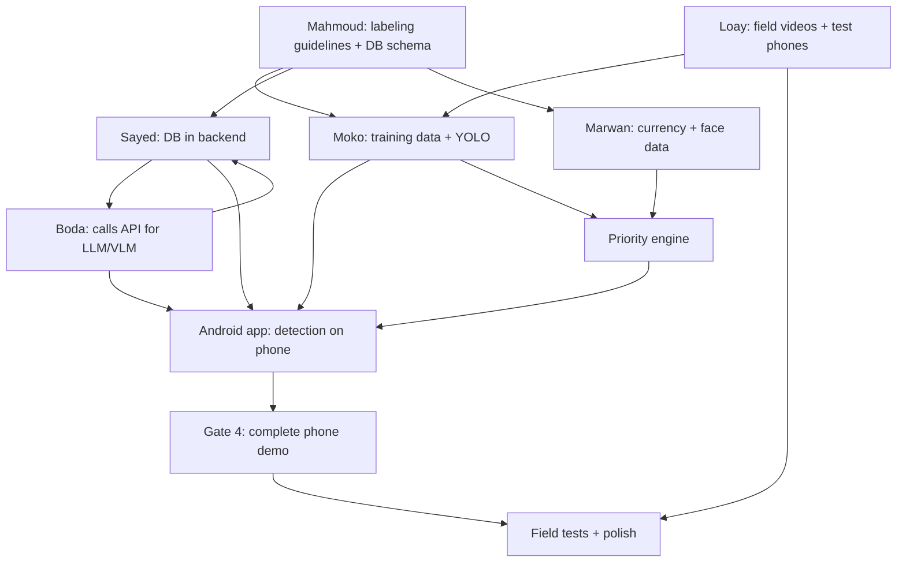

# 👥 TEAM_TASKS: Who Does What, In Which Order, and Who Waits For Whom

Project: **AI Assistive Vision & Navigation System** (Android app + phone camera only)
Team: Mostafa Moko · Boda · Mostafa Sayed · Mahmoud · Marwan · Loay
Duration: 6 months · 6 phases · every phase ends with a gate that must be demonstrated.

> This file complements the main `README.md`. It explains **each person's work in detail** and defines **who depends on whom**. There is no glasses, sensor or custom hardware work anymore.

---

## 0. How to Read This File

| Symbol | Meaning |
|---|---|
| ⏳ **Waits for** | Something you need from someone else before starting this step |
| 📤 **Hands off to** | Whoever is waiting for your output |
| 🧪 **Mock** | A fake version with the final data shape, delivered early so nobody is blocked |
| ✅ **DoD** | Definition of Done: when the step counts as finished |

**Golden rule:** nobody waits for anybody for more than a week. If your real work isn't ready, ship a **Mock** (fixed data in the final format) so the next person can keep going.

---

## 1. Role Summary

| Name | Role |
|---|---|
| **Mostafa Moko** | Computer Vision: YOLO, tracking, OCR, near/far estimate, on-phone model optimization |
| **Boda** | Voice + LLM: STT, TTS, wake word, prompts, intents; pairs on the Android voice flow |
| **Mostafa Sayed** | Backend (FastAPI, Docker) + Android lead (provisional) |
| **Mahmoud** | Database + data + training and evaluation |
| **Marwan** | Priority engine + navigation + audio/haptic cues + currency and face models |
| **Loay** | Integration + test devices + QA + field tests + mock screens + demo + documentation |

### ⚠️ One gap to close in the first two weeks
**Android / Kotlin** (the heart of the project: camera, Accessibility, SOS). **Provisional plan:** Mostafa Sayed is the Android lead and Boda works with him on the voice flow. Two people must know Kotlin. If anyone on the team already has real Android experience, change the assignment on day one.

---

## 2. Contracts To Freeze Early (So Nobody Waits)

| Contract | Written by | Approved by | Deadline |
|---|---|---|---|
| **Event JSON** (the shape of detections entering the engine) | Marwan | Mostafa Moko, Boda, Mostafa Sayed | End of week 1 |
| **Labeling guidelines** (class names and how to label) | Mahmoud | Mostafa Moko, Marwan | End of week 1 |
| **API contract** (`/describe`, `/ask`, `/screen/summarize`, `/intent`, `/health`) | Mostafa Sayed | Boda, Marwan, Android | End of week 2 |
| **DB schema** (users, known_people, settings, alert_log) | Mahmoud | Mostafa Sayed, Marwan | End of week 2 |

Proposed **Event JSON** (`distance_band` is `near`, `medium` or `far`, never meters):

```json
{
  "id": "evt_0142",
  "source": "camera",
  "type": "vehicle_approaching",
  "label": "car",
  "side": "right",
  "distance_band": "near",
  "confidence": 0.87,
  "risk": "critical",
  "timestamp": 1760000000.123
}
```

---

## 3. Dependency Map



### Waiting Table

| Person | Waits for | What for | Mock until it arrives |
|---|---|---|---|
| **Mostafa Moko** | Mahmoud | Labeling guidelines + labeling tool | Start with COCO-pretrained on generic images |
| **Mostafa Moko** | Loay | Video from Egyptian streets | Internet videos, for testing only |
| **Mostafa Moko** | Mostafa Sayed | App shell to test exported models on the phone | Benchmark app on the test phone |
| **Boda** | Mostafa Sayed | API contract + mock backend | Write and test prompts directly against the VLM |
| **Boda** | Android lead | Running the voice flow inside the app | Python prototype on a laptop |
| **Mostafa Sayed** | Mahmoud | DB schema | Temporary SQLite |
| **Mostafa Sayed** | Boda | Final prompts for `/describe` | A fixed simple prompt |
| **Mostafa Sayed (Android)** | Mostafa Moko | Exported YOLO model (LiteRT/ONNX) | A ready COCO model |
| **Mahmoud** | Loay | Real data (banknotes, photos, videos) | Open datasets for experiments |
| **Marwan** | Mostafa Moko | Real events from detection | A hand-written `sample_events.json` |
| **Marwan** | Boda | TTS for playing alerts | Default Android TTS |
| **Loay** | Everyone | Integrating their work in the weekly demo | Integrate Mocks first |

---

## 4. Week 1: What Each Person Ships To Unblock Others

| Person | Ships in week 1 | Unblocks |
|---|---|---|
| **Loay** | Android phone(s), headset, chest mount and power bank bought or decided; GitHub repo + project board | Everyone |
| **Mahmoud** | Labeling guidelines + CVAT/Roboflow account + Weights & Biases | Mostafa Moko |
| **Marwan** | Event JSON v1 | Moko, Boda, Sayed |
| **Mostafa Sayed** | Repo + Docker + **mock backend** returning fixed responses for every endpoint | Boda, Android |
| **Mostafa Moko** | YOLO nano baseline running on a laptop + `sample_events.json` | Marwan |
| **Boda** | Simple prototype: speech → STT → text → TTS on a laptop | Marwan, Sayed |

---

# 5. Detailed Work Per Person

---

## 👤 Mostafa Moko: Computer Vision (YOLO + OCR + Tracking)

**Goal:** the phone sees obstacles, vehicles and people, and reads text, quickly and on the phone itself.

| # | Step | When | ⏳ Waits for | 📤 Hands off to |
|---|---|---|---|---|
| 1 | Set up the environment (PyTorch + Ultralytics or another detector) and run a YOLO nano model on generic images. **Check the license (AGPL).** | Week 1 | — | Marwan (sample events) |
| 2 | Write `sample_events.json` in the agreed format | Week 1 | Marwan (Event JSON) | Marwan, Android |
| 3 | Agree the detection classes with Mahmoud: obstacles, vehicles, people, stairs, potholes | Week 2 | Mahmoud (guidelines) | Mahmoud |
| 4 | Fine-tune detection on local Egyptian data | Month 2 | Loay (videos), Mahmoud (labels) | Android |
| 5 | **Export** to LiteRT/ONNX and test on the phone (FPS and latency) | Month 2 | Android phone from Loay, app shell from Sayed | Android |
| 6 | Evaluate OCR on Egyptian signs, menus and medicine boxes. ML Kit is integrated on the Android side; he builds the evaluation set and the accuracy report | Month 2 | Mahmoud (evaluation set) | Android, Boda |
| 7 | **Tracking + approaching vehicle:** ByteTrack-style tracker + bounding-box growth rate + side (left/right). **No speed claims.** | Month 3 | Detection from step 4 | Marwan (events) |
| 8 | **Near/medium/far estimate** from bounding-box size; optionally test Depth Anything V2-small. Relative only, never meters | Months 3-4 | Detection from step 4 | Marwan |
| 9 | Improve night and low light, tune thresholds | Months 4-5 | Field tests from Loay | Marwan |
| 10 | **Phone optimization:** quantization, GPU/NNAPI delegate, frame-rate scaling when the user is stationary, battery and temperature profiling | Months 4-5 | App running on the phone | Loay, Android |
| 11 | Freeze models + final accuracy and latency report | Month 6 | — | Everyone |

**✅ DoD:** the model emits events in the agreed format, runs 15-25 FPS on the test phone with stable temperature for 30 minutes, and an accuracy report is written.

---

## 👤 Boda: Voice + LLM (STT / TTS / Wake Word / Prompts / Intents)

**Goal:** the user speaks, the assistant understands and answers, and every complex question (scene description, screen summary) becomes a good prompt.

| # | Step | When | ⏳ Waits for | 📤 Hands off to |
|---|---|---|---|---|
| 1 | Laptop prototype: microphone → STT → text → TTS. Try English and Arabic | Week 1 | — | Marwan, Sayed |
| 2 | Choose the VLM/LLM provider, get API keys, set a **monthly spending limit** | Weeks 1-2 | — | Sayed |
| 3 | **Prompts v1:** short, factual scene description and look-and-ask | Weeks 2-3 | API contract from Sayed (optional for testing) | Sayed |
| 4 | **Intent parser:** fixed rules for commands like "open WhatsApp", "SOS", "continue", plus an LLM call for free-form commands. **Emergency commands are always rule-based.** | Month 2 | Command list agreed with Marwan | Android |
| 5 | **Wake word** (openWakeWord or Porcupine) + emergency keywords + false-trigger measurement | Month 2 | Android shell | Android, Marwan |
| 6 | Integrate the voice flow inside the app with Mostafa Sayed | Months 2-3 | Android app shell | Gate 3 |
| 7 | **Screen prompts:** summarize accessibility-tree text, Facebook posts and WhatsApp chats, with an "I may be wrong" phrasing for uncertain answers | Months 3-4 | Screen text samples from Android | Sayed |
| 8 | Translation, smart reading and summarization as prompt variants | Month 4 | — | Sayed |
| 9 | Evaluate against Mahmoud's evaluation set: accuracy, hallucination, cost per request | Months 4-5 | Mahmoud (eval set) | Everyone |
| 10 | Freeze prompts + documented prompt library | Month 6 | — | Everyone |

**✅ DoD:** "What's around me?" answers in under 4 seconds with a short, correct sentence, core commands are understood, and emergency commands work offline.

---

## 👤 Mostafa Sayed: Backend + Android Lead (Provisional)

**Goal:** a stable, fast API first, then the app itself (camera, Accessibility, SOS).

### Part 1: Backend

| # | Step | When | ⏳ Waits for | 📤 Hands off to |
|---|---|---|---|---|
| 1 | Repo + `docker-compose.yml` + FastAPI skeleton + `/health` | Week 1 | — | Everyone |
| 2 | **Mock backend:** every endpoint returns a fixed response in the final shape | Week 1 | — | **Boda and Android (the most important step)** |
| 3 | Write the **API contract** in `docs/api-contract.md` | Week 2 | Input from Boda and Marwan | Everyone |
| 4 | Connect PostgreSQL + pgvector with the agreed schema | Weeks 2-3 | Mahmoud (schema) | Marwan (faces) |
| 5 | `/describe` and `/ask` calling the VLM with the prompts | Month 2 | Boda (prompts v1) | Android |
| 6 | Caching + timeouts + a fallback message instead of crashing | Months 2-3 | — | Android |
| 7 | `/screen/summarize` and `/intent` | Months 3-4 | Boda (screen prompts) | Android |
| 8 | Deploy to a small VPS + basic monitoring + cost limits | Month 3 | — | Everyone |
| 9 | `/faces/enroll` and `/faces/match` (embeddings only, not images) | Months 3-4 | Marwan (face embedding), Mahmoud (DB) | Android |

### Part 2: Android (with Boda)

| # | Step | When | ⏳ Waits for | 📤 Hands off to |
|---|---|---|---|---|
| 10 | Android Studio + app shell + CameraX | Month 1 | Android phone from Loay | Moko, Boda |
| 11 | Run the exported YOLO model on the phone | Month 2 | Moko (export) | Marwan |
| 12 | ML Kit OCR + Android TTS | Month 2 | — | Gate 2 |
| 13 | Integrate Marwan's engine into the app | Months 2-3 | Marwan (engine library) | Gate 3 |
| 14 | **AccessibilityService:** read the screen, scroll, back, open an app (2-3 tested apps only) | Months 3-4 | Boda (intents) | Gate 4 |
| 15 | **NotificationListener:** read WhatsApp notifications (read-only) | Months 3-4 | — | Gate 4 |
| 16 | SOS: SMS + location + a spoken countdown to cancel | Months 3-4 | Marwan (engine, Critical level) | Gate 4 |
| 17 | Phone vibration patterns and audio output routing to the headset | Month 4 | Marwan (cue design) | Gate 4 |
| 18 | Signed APK + guide for enabling "restricted settings" | Month 5 | — | Loay |

**✅ DoD:** the app runs on the target phone, the API responds even if the VLM is down, and SOS sends an SMS with location.

---

## 👤 Mahmoud: Database + Data + Training/Evaluation

**Goal:** clean, labeled data, a ready database, and evaluation by numbers, not by feeling.

| # | Step | When | ⏳ Waits for | 📤 Hands off to |
|---|---|---|---|---|
| 1 | Write **labeling guidelines** (classes and how to label), set up CVAT/Roboflow and Weights & Biases | Week 1 | — | **Moko (waiting on this)** |
| 2 | Design the **DB schema**: users, known_people (embedding), settings, alert_log | Week 2 | Marwan (what the engine needs to store) | Sayed |
| 3 | Data collection plan: EGP banknotes (all denominations, both sides, worn notes, varied lighting) | Weeks 2-3 | Loay (collection) | Marwan |
| 4 | Organized labeling for detection: obstacles, vehicles, people | Months 1-2 | Loay (videos) | Moko |
| 5 | Fixed **evaluation sets**: OCR images (signs, menus, medicine), VLM questions, screens | Month 2 | — | Moko, Boda |
| 6 | Train with Marwan: currency, faces, colors; write an accuracy report | Months 2-4 | Data from step 3 | Marwan |
| 7 | Analysis of the **alert log**: what was said, what was suppressed, false alarms | Months 4-5 | Marwan (engine logs) | Marwan, Loay |
| 8 | Field-test report: numbers and charts for the thesis | Months 5-6 | Loay (field tests) | Everyone |

**✅ DoD:** all data is labeled with the same rules, a fixed evaluation set exists, and the DB runs on the agreed schema.

---

## 👤 Marwan: Priority Engine + Navigation + Models (Currency/Faces)

**Goal:** the engine is **the product**. It decides what gets said, what doesn't, and when.

| # | Step | When | ⏳ Waits for | 📤 Hands off to |
|---|---|---|---|---|
| 1 | Design the **Event JSON** and the risk levels (Critical / Warning / Info) | Week 1 | — | **Moko, Boda, Sayed** |
| 2 | **Engine v1:** event → risk score → threshold → queue, with cooldowns (no repeats) and unit tests | Months 1-2 | `sample_events.json` from Moko | Android |
| 3 | Expose the engine as a library with a simple API (`submit(event)`, `next_to_speak()`) | Month 2 | — | Sayed (Android) |
| 4 | **Currency classifier** (MobileNetV3-class) on EGP data | Months 2-3 | Mahmoud (data) | Android |
| 5 | **Face embedding** (ML Kit detection + MobileFaceNet/ArcFace-style), cosine matching, "someone you don't know" for unknown people | Month 3 | Mahmoud (DB) + Sayed (`/faces`) | Android |
| 6 | **Engine v2:** Critical interrupts, "don't repeat what the user is already hearing", a log of every decision (spoken / suppressed) | Month 3 | Real events from Moko | Gate 3 |
| 7 | **Navigation:** Maps Directions (walking) + turn-by-turn + pre-tested routes | Months 3-4 | Android shell, Boda (TTS) | Gate 4 |
| 8 | **Audio and haptic cues:** stereo panning (left/right) on the headset + phone vibration patterns | Months 4-5 | Android audio routing from Sayed | Gate 4 |
| 9 | Privacy and consent design: face enrollment flow, "screen content goes to the cloud" notice, ethics note for the thesis | Months 4-5 | — | Thesis, Android |
| 10 | Tune thresholds from field-test results | Months 5-6 | Loay (field tests) | Everyone |

**✅ DoD:** the engine has unit tests, suppresses repeats, and the alert log shows what was spoken and what was suppressed.

---

## 👤 Loay: Integration + Test Devices + QA + Field Tests + Demo

**Goal:** the project comes together and works in front of the committee. You are the one who keeps everyone connected.

> You don't need to know everything. Your work is more organization, testing and data collection than code. Learn step by step and work closely with Mahmoud and Marwan.

| # | Step | When | ⏳ Waits for | 📤 Hands off to |
|---|---|---|---|---|
| 1 | **Get the devices immediately:** at least one Android test phone, open-ear headset, chest/neck mount, power bank | **Week 1** | Team agreement on budget | Everyone (the phone blocks Android work!) |
| 2 | GitHub: repo + project board + PR rules + simple CI | Week 1 | — | Everyone |
| 3 | Film **video on Egyptian streets** with the phone on the chest mount (day, night, vehicles, pedestrians, stairs) | Weeks 2-4 | Mount from step 1 | **Moko, Mahmoud** |
| 4 | Collect banknotes, documents and boxes for the dataset | Weeks 2-4 | Mahmoud (plan) | Mahmoud, Marwan |
| 5 | **Test-device setup:** install a benchmark app, record baseline battery and temperature, set up test accounts and a fixed phone configuration | Months 1-2 | Phone from step 1 | Moko, Sayed |
| 6 | **Test plan** + test scenarios + a device/OS matrix | Months 2-3 | — | Everyone |
| 7 | **Weekly integration demo:** merge the latest work and show it to the team | From week 2 | Everyone's work (or Mocks) | Everyone |
| 8 | Prepare **mock WhatsApp/Facebook screens** and test accounts for demos and regression tests | Months 2-3 | — | Sayed, Boda |
| 9 | **Build regression checklist:** install every new build on the test phones and run the core scenarios | Months 3-5 | Builds from Sayed | Everyone |
| 10 | **Battery and thermal tests:** 30-minute continuous session logs | Months 4-5 | App + models running | Moko |
| 11 | **Field tests** with visually impaired volunteers (written consent) on a pre-tested route, recording the alert log | Months 5-6 | App + engine working | Mahmoud, Marwan |
| 12 | **Demo script** (8-10 minutes) + a backup video of every step + power bank and hotspot ready | Months 5-6 | — | Everyone |
| 13 | Assemble the thesis and documentation, track the budget | Months 5-6 | — | Everyone |

**✅ DoD:** an integrated demo exists every week, a 30-minute session runs stably, and a backup video exists for each demo step.

---

# 6. Six-Month Timeline With Gates

| Month | Mostafa Moko | Boda | Mostafa Sayed | Mahmoud | Marwan | Loay |
|---|---|---|---|---|---|---|
| **1** | YOLO baseline, sample events | STT/TTS prototype, API keys | Mock backend, Docker, Android shell | Guidelines, DB schema | Event JSON, engine design | **Buy phones/accessories**, repo, videos |
| **2** | Fine-tune, export, OCR eval | Prompts, intents, wake word | `/describe`, CameraX, run YOLO | Labeling, eval sets | Engine v1, currency | Test-device setup, test plan |
| **3** | Tracking, near/far estimate | Voice flow in the app | Deploy, DB, Accessibility | Currency/face training | Engine v2, faces, navigation | Weekly demos, mock screens |
| **4** | Night tuning, optimization | Screen prompts | Notifications, SOS | Alert log analysis | Turn-by-turn, audio/haptic cues | Build regression checks |
| **5** | Battery/thermal tuning | Evaluation, translation | APK + stability | Field-test analysis | Tuning, privacy note | Field tests, battery logs |
| **6** | Freeze models | Freeze prompts | Freeze API/app | Final report | Freeze engine | Demo script, thesis |

### Gates

| Gate | Month | Must work |
|---|---|---|
| 1. Foundation | 1 | Camera to speech works |
| 2. Vision basics | 2 | Detects, warns, reads text |
| 3. Voice + VLM | 3 | "What's around me?" answers + faces |
| **4. Screen + Nav (the key one)** | 4 | Screen reading + SOS + navigation = **complete phone demo** |
| 5. Polish + field tests | 5 | 30-minute session is stable, volunteers have tested |
| 6. Test + Demo | 6 | Feature freeze + final demo |

> **Safety net:** Gate 4 already gives you a complete graduation demo. Months 5-6 are for polish, extra features (currency, Reels) and testing with real users.

---

# 7. Working Rules So Nobody Gets Blocked

1. **Mock first, real later.** Ship the final data shape with fixed values in week 1.
2. **Weekly integration demo** (30 minutes): everyone shows something that works, not slides.
3. **Every PR needs at least one reviewer from a different role** before merging into `develop`.
4. **Anyone blocked more than 3 days** on someone else says so in the group chat, and Plan B is the Mock.
5. **Freeze the Must Have list** in month 1 and review it monthly. No new features before Gate 4.
6. **Privacy:** no images stored by default, face enrollment is opt-in and stores embeddings only, and the app tells the user that screen content is sent to a cloud model.
7. **No safety claims:** this is an assistive prototype, not a replacement for a cane or a guide, and distance is relative (near/medium/far), never meters.

---

# 8. Questions To Answer In The First Meeting

- [ ] Who will seriously learn **Kotlin/Android** (two people are required)?
- [ ] Who buys the Android phone, and with what budget?
- [ ] Who owns the **API keys and spending limits**?
- [ ] Which group chat and which fixed time for the weekly demo?
